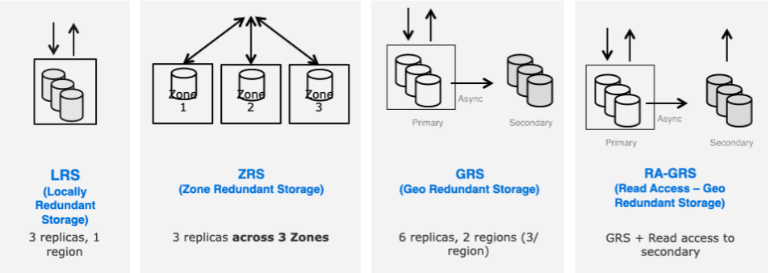

# Microsoft-AZ900
> These are my personal notes from studying for the Microsoft Fundamentals AZ-900 exam.>

## Table of Contents

- [Cloud-Concepts](#Cloud-Concepts)
- [Core-Azure-Services](#Core-Azure-Services)

---

## Cloud-Concepts

#### Identify the benefits and considerations of using cloud services 

1. Cost effective – PAY GO model or consumption-based model 
2. Allows better cost prediction 
3. It's scalable – vertical and horizontal scaling 
4. It's elastic – automatically allocate resources upon peak periods, or removes resources during non-peak periods 
5. It's current – cloud provider manages patches, updates, etc. 
6. It's reliable – data and resources will always be available 
7. It's global – multiple datacenters in multiple regions; replication + redundancy 
8. It's secure – physical and digital security 

#### Describe terms such as high availability, scalability, elasticity, agility, Fault Tolerance, and disaster recovery 
- High availability - run as designed in a healthy state with no significant downtime (up and running for long periods of time) 
  - the goal is to minimize the effects of a single failing component 
- Scalability is the ability of a system to handle increased load; scaling allows applications to react to variable load by increasing and decreasing the number of instances of roles, queues, and other services; application services must be stateless; know upper and scaling limits, and use sharding or decomposition to go beyond those limits; ensure the application doesn't require affinity; use built-in autoscaling features when possible; ability to increase or decrease resources for any given workload 
  - Scale out = add more systems; scale up = add more resources (e.g. CPU, RAM) to the same resource 
  - Does not have to be done automatically 
- Elasticity - automatically add/remove resources based on demand; Azure Advisor and Azure Cost Management are two services that help you optimize cloud spend and elasticity; is the ability to use as much capacity as you need, scaling out as load increases, and scaling in when the extra capacity is not needed; ability to automatically or dynamically increase or decrease resources as needed; elasticity is done automatically/dynamically whereas scalability does not have to be done automatically 
- Agility – ability to rapidly change IT infrastructure (react quickly) in order to adapt to evolving needs of the business (e.g. online website that peaks during holiday hours); ability to react quickly; cloud services can allocate and deallocate as needed; on-demand services via self-service; no manual intervention when provisioning / deprovisioning services 
- Fault Tolerance – ability to remain up and running even in event of a component or service failure; redundancy is built into cloud services architecture; the type of service is said to be "tolerant of faults" 
- Disaster Recovery – the ability to recover from major incidents; non transient; wide scale features such as service disruption that affects entire region; DR includes data backup and archiving which may include manual intervention (e.g. restore DB from backup) 

#### Describe the principles of economies of scale 
- Is the ability to do things more efficiently or at a lower cost per unit when operating at a large scale 
- Cloud savings are passed to end users 
  - Ability to acquire hardware at lower cost 
  - Cloud service providers can make deals with government and utilities providers to get tax savings on lower price for power/cooling, etc. 
  - CSP's then pass these savings on to end users thereby making public cloud services cheaper 
- Concept is about the ability to do things more cheaply and more efficiently when operating at larger scale 

#### Describe the differences between Capital Expenditure (CapEx) and Operational Expenditure (OpEx) 
- CAPEX = when an organization decides to own infrastructure, it buys equipment that goes onto the balance sheet as assets (upfront cost). Because a capital investment was made, accountants categorize this transaction as CAPEX 
  - Spending money on physical infrastructure upfront 
  - Value reduces over time – servers, storage, networking, backup, technical personnel, etc. 
  - Assets are depreciated or amortized 
 
- OPEX = Cloud services are categorized as operating expenses, because of their consumption model. There is no asset to amortize. Instead, OPEX has direct impact on net profit, taxable income, and associated expenses on balance sheet 
  - Leasing software, scaling charges, billing at the user or organizational level
  - No upfront costs 
  - Pay per month / per year 
  - Spending money on services and products NOW and being charged for them NOW 

#### Describe the consumption-based model 
- Most (if not all) CSP's operate on this model 
- No upfront costs; no need to purchase and manage infrastructure; PAY GO model (pay for what you use) 
- Ability to pay for additional resources when you need them 
- Ability to stop paying for resources when you don't need them 
- CSP's provide computing as a utility – to be consumed on-demand 
- No minimums or commitments 
- Competitive pricing 
- Cancel anytime 

#### Describe Infrastructure-as-a-Service (IaaS)  
- most basic category of cloud computing services. With IaaS, you rent IT infrastructure—servers and virtual machines (VMs), storage, networks, operating systems—from a cloud provider on a pay-as-you-go basis 
- is an instant computing infrastructure, provisioned and managed over the internet 
- quickly scales up and down with demand, letting you pay only for what you use 
- Each resource is offered as a separate service component, and you only need to rent a particular one for as long as you need it 
- A cloud computing service provider, such as Azure, manages the infrastructure, while you purchase, install, configure, and manage your own software—operating systems, middleware, and applications. 

Common scenario's: 
- Test / dev 
- Migrating workloads 
- Website hosting 
- Storage, backup and recovery 
- Web apps 
- High performance applications (HPC) 
- Big data analysis 

Advantages 
- Eliminate CAPEX and reduce ongoing cost (no upfront costs) 
- Improve BC/DR 
- Innovate rapidly 
- Respond quicker to shifting business conditions 
- Focus on your core business 
- Increase stability, reliability, supportability 
- Better security 
- Get new apps faster to end users 

#### Describe Platform-as-a-Service (PaaS)  
- refers to cloud computing services that supply an on-demand environment for developing, testing, delivering, and managing software applications.  
- PaaS is designed to make it easier for developers to quickly create web or mobile apps, without worrying about setting up or managing the underlying infrastructure of servers, storage, network, and databases needed for development. 
- is a complete development and deployment environment in the cloud, with resources that enable you to deliver everything from simple cloud-based apps to sophisticated, cloud-enabled enterprise applications. You purchase the resources you need from a cloud service provider on a pay-as-you-go basis and access them over a secure Internet connection. 
- PaaS includes infrastructure—servers, storage, and networking—but also middleware, development tools, business intelligence (BI) services, database management systems, and more. PaaS is designed to support the complete web application lifecycle: building, testing, deploying, managing, and updating. 
- You manage the applications and services you develop, and the cloud service provider typically manages everything else 
- PAY GO model 
- End user responsible for application development; no upfront costs 
- Avoids expense and complexity of buying and managing software licenses 

Common scenario's: 
- Development framework 
- Analytics or Business Intelligence (BI) 
- Additional services like workflows, directory, security, and scheduling 

Advantages 
- Cut coding time 
- Add DEV capabilities without adding staff 
- Multiple platform development - mobile 
- Use of sophisticated tools 
- Support geographically distributed development teams 
- Manage application lifecycles 

#### Describe Software-as-a-Service (SaaS)  
- Software as a service is a method for delivering software applications over the Internet, on demand and typically on a subscription basis (can also be monthly/annual). With SaaS, cloud providers host and manage the software application and underlying infrastructure, and handle any maintenance, like software upgrades and security patching. Users connect to the application over the Internet, usually with a web browser on their phone, tablet, or PC. 
- allows users to connect to and use cloud-based apps over the Internet. Common examples are email, calendaring, and office tools (such as Microsoft Office 365). 
- purchase on a pay-as-you-go basis / PAY GO model 
- You rent the use of an app for your organization, and your users connect to it over the Internet, usually with a web browser. All of the underlying infrastructure, middleware, app software, and app data are located in the service provider’s data center. The service provider manages the hardware and software, and with the appropriate service agreement, will ensure the availability and the security of the app and your data as well. 
  
Common scenario's: 
- web-based email service such as Outlook, Hotmail, or Yahoo! Mail 
- sophisticated business applications such as customer relationship management (CRM), enterprise resource planning (ERP), and document management. You pay for the use of these apps by subscription or according to the level of use. 
  
Advantages: 
- Access to sophisticated applications – no upfront costs 
- Predictive cost model
- Use free client software 
- Mobilize your workforce 
- Access data application anywhere 

#### Compare and contrast the 3 difference service delivery models  
1. IaaS – requires most user management; user responsible for managing OS, data, applications, security patches, etc. 
2. PaaS – requires less user management; CSP manages the OS and the user manages the applications and data 
3. SaaS – requires least amount of management; CSP manages everything and the user manages the software 

Define cloud computing 
- you only pay for what you need / pay for what you use 
- Cloud computing is when you access computing services—like servers, storage, networking, software—over the internet (“the cloud”) from a provider like Azure 
- you don't worry about how or when to upgrade to the latest technology 
- You don't have to manage scaling resources 
- Cloud computing is renting resources, like storage space or CPU cycles, on another company's computers 
- cloud provider is responsible for the physical hardware required to execute your work, and for keeping it up-to-date 
- CSP provides compute, network, storage, and analytics solutions 
- Is the delivery of computing services over the internet 

#### Describe public cloud 
- Most common type of deployment 
- are owned and operated by a third-party cloud service providers, which deliver their computing resources, like servers and storage, over the Internet. Microsoft Azure is an example of a public cloud. With a public cloud, all hardware, software, and other supporting infrastructure is owned and managed by the cloud provider.  
- You access these services and manage your account using a web browser. 
- PAY GO model – cheapest cloud model 
- Multitenant model 
- Does not require deep technical knowledge to set up and use its resources 
 
Advantages 
- High scalability / agility 
- No CAPEX 
- PAY GO (consumption-based model) 
- User not responsible for managing underlying hardware, updates, maintenance, etc 
- Minimal technical knowledge 
- Public access over the internet/browser 

#### Describe private cloud 
- cloud computing resources used exclusively by a single business or organization (self-service access) 
- A private cloud can be physically located on the company’s on-site datacenter. Some companies also pay third-party service providers to host their private cloud.  
- A private cloud is one in which the services and infrastructure are maintained on a private network. 
- User is responsible for maintenance, updates, hardware, etc. 
- Costs to maintain a private cloud are high 
- Requires more technical skills/resources/knowledge 
- Some initial CAPEX may be required 
- Limits agility 
 
Advantages 
- Ensures configurations are met for specific business cases 
- You have complete control over security – compliance, regulations, legal requirements 
- Medical data is secure 
- Government data / sites 

#### Describe hybrid cloud 
- Hybrid clouds combine public and private clouds, bound together by technology that allows data and applications to be shared between them. By allowing data and applications to move between private and public clouds, a hybrid cloud gives your business greater flexibility, more deployment options, and helps optimize your existing infrastructure, security, and compliance. 
- Example – put web app in public cloud, while DB is in private cloud 
- Specific resources run in public cloud while others used in private cloud 
- May be more expensive than selecting a single cloud model – complicated to set up, configure, etc. 
- Moderate technical knowledge required 
- Some resources cannot be put in a public cloud for legal/compliance reasons 
- can still run legacy applications/infrastructure in private cloud, while taking newer applications to the public cloud 
 
Advantages 
- Keep systems running even with out-of-date/legacy hardware or OS 
- Flexibility 
- Take advantages of economies of scale from public cloud providers while supplementing with your own hardware/software when needed 

#### Compare and contrast the 3 different cloud models 

Type | Advantages | Disadvantages
------------ | ------------ | -------------
Public | High Scalability and Agility, PAYG (No CapEx, OpEx model), Not responsible for hardware maintenance, Minimal technical knowledge required | May not be able to meet specific security requirements, May not be able to meet specific compliance requirements, You don't own the hardware and may not be able to manage them as you wish
Private | You have complete control, Can meet strict security and compliance requirements | Upfront CapEx costs, Owning equipment limits agility to scale, Requires high technical knowledge
Hybrid | advantages of both private and public, flexibility | Can be more expensive than selecting one deployment model, Can be more complicated to set up and manage, CAPEX

## Core-Azure-Services

#### Describe the benefit and usage of Regions 
- A region is a set/collection of datacenters deployed within a latency-defined perimeter and connected through a dedicated regional low-latency network 
- Is a geographical area (physical location) containing at least 1 or more datacenters that are in close proximity and networked together via low latency network 
- Pick a region that closest to users; pick a region due to cost; pick a region due to compliance reasons; some regions may not have all available features

Azure has some special regions that you may wish to use when building out your applications for compliance or legal purposes. These special regions include: 
- US Gov Virginia and US Gov Iowa 
  - A physical and logical network-isolated instance of Azure for US government agencies and partners, operated by screened US persons. Includes additional compliance certifications such as FedRAMP and DISA. Read more about Azure Government. 
- China East and China North 
  - These regions are available through a unique partnership between Microsoft and 21Vianet, whereby Microsoft does not directly maintain the datacenters. See more about Azure China 21Vianet. 
- Germany Central and Germany Northeast 
  - These regions are available via a data trustee model whereby customer data remains in Germany under control of T-Systems, a Deutsche Telekom company, acting as the German data trustee. 

Each Azure region is paired with another region within same geography 
- Allows for replication of resources 
- 300 miles of separation between regions
- Region pairs must be in same geography
- One region out of every pair is prioritized to help reduce time it takes to restore applications, etc. 
  - Planned updates are rolled out to paired regions, one region at a time 
  - Data resides in same geography as its pair for tax/law jurisdiction purposes 

Azure is generally available in 52+ regions worldwide with plans to announce 6+ in future 
- Minimum 3 zones in each region 
- some services or VM features are only available in certain regions; some products are only available in certain regions 
 
Geography – is a discrete market typically containing 2 or more regions that preserve data residency and compliance boundaries 
- Allows customers with specific data residency and compliance needs to keep their data and applications close 
- Americas, Europe, Asia Pacific, Middle East, Africa 
 
Hierarchy: Geography -> Region -> Availability Zone -> Availability Set -> Fault Domain -> Update Domain 

#### Describe the benefit and usage of Availability Zones 
- Availability Zones are physically separate locations within an Azure region.  
- Each Availability Zone is made up of one or more datacenters equipped with independent power, cooling, and networking. 
- Availability Zones allow customers to run mission-critical applications with high availability and low-latency replication. 
- is a high-availability offering that protects your applications and data from datacenter failures.  
- Availability Zones are unique physical locations within an Azure region 
  - minimum of 3 separate zones in all enabled regions 
- is a combination of a fault domain and an update domain 
  - For example, if you create three or more VMs across three zones in an Azure region, your VMs are effectively distributed across three fault domains and three update domains.   - The Azure platform recognizes this distribution across update domains to make sure that VMs in different zones are not updated at the same time. 
- A fault domain is a logical group of underlying hardware that share a common power source and network switch, similar to a rack within an on-premises datacenter. 
  - Physical separate
  - Up to 5 fault domains inside an availability set
- An update domain is a logical group of underlying hardware that can undergo maintenance or be rebooted at the same time. 
  - Up to 20 UD in an availability set
- This approach ensures that at least one instance of your application always remains running as the Azure platform undergoes periodic maintenance. The order of update domains being rebooted may not proceed sequentially during maintenance, but only one update domain is rebooted at a time. 

- Azure services that support Availability Zones fall into two categories: 
  - Zonal services – you pin the resource to a specific zone (for example, virtual machines, managed disks, Standard IP addresses), or 
  - Zone-redundant services – platform replicates automatically across zones (for example, zone-redundant storage, SQL Database). 
- 99.99% VM uptime SLA is offered when two or more VMs are deployed across two or more Availability Zones within an Azure region 
- No cost for deploying resources in AZ's 

#### Describe the benefit and usage of Resource Groups 
A resource group is a container that holds related resources for an Azure solution 
- Is a unit of management for Azure resources 
- MUST create this first
- Includes those resources you want to manage as a group 
- Is a collection of azure resources — azure resources must existing in 1 and only 1 resource group
- RBAC is included 
 
You can manage: 
- Metering and billing 
- Policies 
- Monitoring and alerts 
- Quotas 
- Access control 
- NOTE: if you delete a resource group, all resources are also deleted 
 
Resource group stores metadata about those resources 
- Metadata follows where you put the resource group location; therefore, when you specify a location for the resource group, you are specifying where that metadata is stored 
- Locking prevents users in your organization from accidentally deleting or modifying critical resources 

All the resources in your resource group should share the same / similar life cycle 
- You deploy, update, and delete them together 
- Each resource can only exist in one resource group 
- You can add or remove a resource at any time 
- You can move a resource from one group to another 
- A resource group can contain resources that are located in different regions 
- A resource group can be used to scope access control for administrative actions 
- A resource group can interact with resources in other resource groups 
- You can export Azure Resource Manager (ARM) templates to 1) automate future deployments, and 2) learn JSON syntax that represents a solution 
 
You can apply tags to resource groups and resources to logically organize your assets. For information, see Using tags to organize your Azure resources. 

#### Describe the benefit and usage of Azure Resource Manager 
- Is the deployment and management service for Azure – provides a management layer that enables you to create, update, and delete resources in your Azure subscription 
- Allows you to automate the deployment and configuration of resources using different tools like PowerShell, Azure CLI, Portal, REST API, and SDK 
- A resource is a manageable item through Azure (VM, storage accounts, web apps, database's, etc) 
 
You use management features like access control, locks, and tags to secure and organize resources after deployment 
- When a user sends a request from any of the Azure tools, ARM receives this request. It then authenticates and authorizes the request. ARM sends the request to the Azure service which takes the requested action. All requests are handled through the same API and therefore has consistent results 

ARM Template - A JavaScript Object Notation (JSON) file that defines one or more resources to deploy to a resource group or subscription. The template can be used to deploy the resources consistently and repeatedly. See Template deployment overview. 
  
Azure provides four levels of scope: management groups, subscriptions, resource groups, and resources. The following image shows an example of these layers. 

You apply management settings at any of these levels of scope. The level you select determines how widely the setting is applied. Lower levels inherit settings from higher levels. For example, when you apply a policy to the subscription, the policy is applied to all resource groups and resources in your subscription. When you apply a policy on the resource group, that policy is applied the resource group and all its resources. However, another resource group doesn't have that policy assignment. 
- You can deploy templates to management groups, subscriptions, or resource groups. 

Resource Manager and control plane operations (requests sent to management.azure.com) in the REST API are: 
- Distributed across regions. Some services are regional. 
- Distributed across Availability Zones (as well regions) in locations that have multiple Availability Zones. 
- Not dependent on a single logical data center. 
- Never taken down for maintenance activities. 
 
Benefits: 
- Use of declarative templates (JSON file) rather than scripts 
- Deploy, manage, and monitor all resources for your solution as a group 
- Capable of redeploying solution throughout development cycle 
- Defines dependencies between resources 
- RBAC 
- Ability to apply tags 
- Clarity of organizational billing via costs for groups of resources and sharing the same tag(s) 

#### Describe products available for compute products such as Virtual Machines, VM Scale Sets, App Services, Azure Container Instances (ACI), Azure Kubernetes Service (AKS)  
Virtual Machines 
- Is one of several types of on-demand scalable computing resources that Azure offers 
- VM's are software emulations of physical computers 
- Are offered as IaaS 
- single instance virtual machine SLA of 99.9% provided you deploy the VM with premium and managed storage for all disks
- VM SLA of 99.95% when deployed with 2 VMs in an availability set
- Virtual Machines that have two or more instances deployed across two or more Availability Zones in the same Azure region, we guarantee you will have Virtual Machine Connectivity to at least one instance at least 99.99% of the time

VM Scale Sets 
- Are Azure compute resources you can use to deploy and manage a set of identical VM's (load balanced VM's) 
- The number of VM instances can automatically increase or decrease in response to demand or a defined schedule. Scale sets provide high availability to your applications, and allow you to centrally manage, configure, and update many VMs. We recommended that two or more VMs are created within a scale set to provide for a highly available application and to meet the 99.95% Azure SLA. 
- There is no cost for the scale set itself, you only pay for each VM instance that you create. 
- When a single VM is using Azure premium SSDs, the Azure SLA applies for unplanned maintenance events. Virtual machines in a scale set can be deployed across multiple update domains and fault domains to maximize availability and resilience to outages due to data center outages, and planned or unplanned maintenance events. Virtual machines in a scale set can also be deployed into a single Availability zone, or regionally. Availability zone deployment options may differ based on the orchestration mode. 
- All VM's are the same so Scale Sets supports true autoscale (no pre-provisioning of VMs) 
- Targets big data compute jobs and containerized workloads 
- Manual or automated tasks 
 
Typically choose a VM when you need more control over the computing environment (like the OS) 
- Still need to maintain the VM like configuring, patching, and installing software 
- VM use cases = Dev/Test, applications in the cloud, extend your datacenter 
- The location specifies where the virtual hard disks (VHD) are stored 
- HOURLY price based on VM size + operating system 
- A VM subscription has default quota limits – current default is 20 VM's per region but can be increased via support ticket 

Availability Set
An Availability Set is a logical grouping of VMs within a datacenter that allows Azure to understand how your application is built to provide for redundancy and availability. We recommended that 2 or more VMs are created within an availability set to provide for a highly available application and to meet the 99.95% Azure SLA.  
There is no cost for the Availability Set itself, you only pay for each VM instance that you create. When a single VM is using Azure premium SSDs, the Azure SLA applies for unplanned maintenance events. 
- It ensures your application remains online if a high-impact maintenance event is required or hardware failure occurs 
- In an availability set, VMs are automatically distributed across these fault domains. This approach limits the impact of potential physical hardware failures, network outages, or power interruptions. 
- For VMs using Azure Managed Disks, VMs are aligned with managed disk fault domains when using a managed availability set. This alignment ensures that all the managed disks attached to a VM are within the same managed disk fault domain. 
- Only VMs with managed disks can be created in a managed availability set. The number of managed disk fault domains varies by region - either two or three managed disk fault domains per region. You can read more about these managed disk fault domains for Linux VMs or Windows VMs. 

Fault Domain and Update Domain

Azure App Service = PaaS
- is an HTTP-based service for hosting web applications, REST APIs, and mobile back ends. 
- fully managed compute platform that is optimized for hosting websites and web applications
- can also take advantage of its DevOps capabilities, such as continuous deployment from Azure DevOps, GitHub, Docker Hub, and other sources, package management, staging environments, custom domain, and SSL certificates. 
- With App Service, you pay for the Azure compute resources you use. The compute resources you use is determined by the App Service plan that you run your apps on 
App Service Environment is an Azure App Service feature that provides a fully isolated and dedicated environment for securely running App Service apps at high scale. 
- Besides App Service, Azure offers other services that can be used for hosting websites and web applications. For most scenarios, App Service is the best choice. For microservice architecture, consider Service Fabric

Whatever apps you put into this App Service plan run on these compute resources as defined by your App Service plan. Each App Service plan defines: 
1. Region (West US, East US, etc.) 
2. Number of VM instances 
3. Size of VM instances (Small, Medium, Large) 
4. Pricing tier (Free, Shared, Basic, Standard, Premium, PremiumV2, Isolated) 

Benefits 
- Multiple languages supported 
- DevOps optimization 
- Global scale with HA 
- SaaS and on-premise connectivity 
- Application templates 
- Serverless 
- API+Mobile features 
- Visual Studio integration 
- Is ISO, SOC, and PCI compliant 

Azure Container Instances (ACI) = PaaS
- Is the fastest and simplest way to run a container in Azure without having to manage any virtual instances (basically containers as a service) 
- is a great solution for any scenario that can operate in isolated containers, including simple applications, task automation, and build jobs. 
- Is a PaaS offering 
- Pay based on what you need and get billed by the second – PAY GO model 
- ACI uses Azure Files shares backed by Azure Storage for persistent storage 
- For compute-intensive jobs such as machine learning, Azure Container Instances can schedule Linux containers to use NVIDIA Tesla GPU resources (preview). 
 
YAML is recommended for container deployments 
Can use ARM templates to deploy ACI and containers 

Azure Kubernetes Service (AKS) = PaaS
- Azure Kubernetes Service (AKS) makes it simple to deploy a managed Kubernetes cluster in Azure. AKS reduces the complexity and operational overhead of managing Kubernetes by offloading much of that responsibility to Azure. As a hosted Kubernetes service, Azure handles critical tasks like health monitoring and maintenance for you. The Kubernetes masters are managed by Azure. You only manage and maintain the agent nodes. As a managed Kubernetes service, AKS is free - you only pay for the agent nodes within your clusters, not for the masters. 
- You can create an AKS cluster in the Azure portal, with the Azure CLI, or template driven deployment options such as Resource Manager templates and Terraform. When you deploy an AKS cluster, the Kubernetes master and all nodes are deployed and configured for you. Additional features such as advanced networking, Azure Active Directory integration, and monitoring can also be configured during the deployment process. Windows Server containers support is currently in preview in AKS. 
- AKS lets you integrate with Azure Active Directory and use Kubernetes role-based access controls. You can also monitor the health of your cluster and resources. 

AKS supports Kubernetes role-based access control (RBAC). RBAC lets you control access to Kubernetes resources and namespaces, and permissions to those resources. You can also configure an AKS cluster to integrate with Azure Active Directory (AD).

Azure Monitor for container health collects memory and processor metrics from containers, nodes, and controllers. Container logs are available, and you can also review the Kubernetes master logs. This monitoring data is stored in an Azure Log Analytics workspace, and is available through the Azure portal, Azure CLI, or a REST endpoint.

AKS nodes run on Azure virtual machines. You can connect storage to nodes and pods, upgrade cluster components, and use GPUs. AKS supports Kubernetes clusters that run multiple node pools to support mixed operating systems and Windows Server containers (currently in preview). Linux nodes run a customized Ubuntu OS image, and Windows Server nodes run a customized Windows Server 2019 OS image.

An AKS cluster can be deployed into an existing virtual network. In this configuration, every pod in the cluster is assigned an IP address in the virtual network, and can directly communicate with other pods in the cluster, and other nodes in the virtual network. Pods can connect also to other services in a peered virtual network, and to on-premises networks over ExpressRoute or site-to-site (S2S) VPN connections.

AKS supports the Docker image format. For private storage of your Docker images, you can integrate AKS with Azure Container Registry (ACR).

Azure Kubernetes Service (AKS) is compliant with SOC, ISO, PCI DSS, and HIPAA 

Nodes and node pools 
To run your applications and supporting services, you need a Kubernetes node. An AKS cluster has one or more nodes, which is an Azure virtual machine (VM) that runs the Kubernetes node components and container runtime: 
- The kubelet is the Kubernetes agent that processes the orchestration requests from the control plane and scheduling of running the requested containers. 
- Virtual networking is handled by the kube-proxy on each node. The proxy routes network traffic and manages IP addressing for services and pods. 
- The container runtime is the component that allows containerized applications to run and interact with additional resources such as the virtual network and storage. In AKS, Moby is used as the container runtime. (other public options are Docker, CRI-O, containerd)

#### Describe products available for networking such as Virtual Networks, Load Balancer, VPN Gateway, Application Gateway, and CDN 
Virtual Networks 
- is a logical representation of your network in the cloud. It allows you to define your own private IP address space and segment the network into subnets.
- VNets serves as a trust boundary to host your compute resources such as Azure Virtual Machines and Cloud Services (web/worker roles). A VNet allows direct private IP communication between the resources hosted in it. You can link a virtual network to an on-premises network through a VPN Gateway, or ExpressRoute. 
- Public IP addresses may have a nominal charge. To learn more about IP address pricing in Azure, review the IP address pricing page.
- $0.0036/hour

VNet concepts 
- Address space: When creating a VNet, you must specify a custom private IP address space using public and private (RFC 1918) addresses. Azure assigns resources in a virtual network a private IP address from the address space that you assign. For example, if you deploy a VM in a VNet with address space, 10.0.0.0/16, the VM will be assigned a private IP like 10.0.0.4. 
- Subnets: Subnets enable you to segment the virtual network into one or more sub-networks and allocate a portion of the virtual network's address space to each subnet. You can then deploy Azure resources in a specific subnet. Just like in a traditional network, subnets allow you to segment your VNet address space into segments that are appropriate for the organization's internal network. This also improves address allocation efficiency. You can secure resources within subnets using Network Security Groups. For more information, see Security groups. 
- Regions: VNet is scoped to a single region/location; however, multiple virtual networks from different regions can be connected together using Virtual Network Peering. 
Subscription: VNet is scoped to a subscription. You can implement multiple virtual networks within each Azure subscription and Azure region. 

All resources in a VNet can communicate outbound to the internet, by default. You can communicate inbound to a resource by assigning a public IP address or a public Load Balancer. You can also use public IP or public Load Balancer to manage your outbound connections

Outbound communication is enabled by default; inbound communication requires public IP address or load balancer IP address

You can filter network traffic between subnets using either or both of the following options: 
- Security groups: Network security groups and application security groups can contain multiple inbound and outbound security rules that enable you to filter traffic to and from resources by source and destination IP address, port, and protocol. To learn more, see Network security groups or Application security groups. 
- Network virtual appliances: A network virtual appliance is a VM that performs a network function, such as a firewall, WAN optimization, or other network function. To view a list of available network virtual appliances that you can deploy in a virtual network, see Azure Marketplace.
- There is no charge for using Azure VNet, it is free of cost. Standard charges are applicable for resources, such as Virtual Machines (VMs) and other products 
- On-premise communication: P2P, Site-to-site VPN, or via ExpressRoute 

Load Balancer 
- Refers to evenly distributing load (incoming network traffic) across a group of backend resources or servers.
- Azure Load Balancer operates at layer 4 of the Open Systems Interconnection (OSI) model. It's the single point of contact for clients. Load Balancer distributes inbound flows that arrive at the load balancer's front end to backend pool instances. These flows are according to configured load balancing rules and health probes. The backend pool instances can be Azure Virtual Machines or instances in a virtual machine scale set.
- operate at the transport layer (OSI layer 4 - TCP and UDP) and route traffic based on source IP address and port, to a destination IP address and port.

VPN Gateway 
- is used to send encrypted traffic between an Azure virtual network and an on-premises location over the public Internet
- Each virtual network can only have one VPN gateway

A virtual network gateway is composed of two or more VMs that are deployed to a specific subnet you create called the gateway subnet. Virtual network gateway VMs contain routing tables and run specific gateway services. These VMs are created when you create the virtual network gateway. You can't directly configure the VMs that are part of the virtual network gateway.
- One setting that you configure for a virtual network gateway is the gateway type. Gateway type specifies how the virtual network gateway will be used and the actions that the gateway takes. The gateway type 'Vpn' specifies that the type of virtual network gateway created is a 'VPN gateway', rather than an ExpressRoute gateway. A virtual network can have two virtual network gateways; one VPN gateway and one ExpressRoute gateway
- The gateway subnet contains the IP addresses that the virtual network gateway services use. You need to create a gateway subnet for your VNet in order to configure a virtual network gateway. All gateway subnets must be named 'GatewaySubnet' to work properly

Application Gateway = WAF
- is a web traffic load balancer that enables you to manage traffic to your web applications
- Application Gateway can make routing decisions based on additional attributes of an HTTP request, for example URI path or host headers. For example, you can route traffic based on the incoming URL. So if /images is in the incoming URL, you can route traffic to a specific set of servers (known as a pool) configured for images. If /video is in the URL, that traffic is routed to another pool that's optimized for videos.
- This type of routing is known as application layer (OSI layer 7) load balancing. Azure Application Gateway can do URL-based routing and more.

CDN 
- Is a distributed network of servers that can efficiently deliver web content to users. 
- CDNs store cached content on edge servers in point-of-presence (POP) locations that are close to end users, to minimize latency

#### Describe products available for storage such as Blob, Disk Storage, File Storage, and Archive Storage

Blob Storage - Azure Blob storage is Microsoft's object storage solution for the cloud. Blob storage is optimized for storing massive amounts of unstructured data. Unstructured data is data that doesn't adhere to a particular data model or definition, such as text or binary data. 
- Highly scalable 
- Can manage thousands of simultaneous uploads 
- No file format per se 
- Tiered storage 
 
Blob storage is designed for: 
- Serving images or documents directly to a browser. 
- Storing files for distributed access. 
- Streaming video and audio. 
- Writing to log files. 
- Storing data for backup and restore, disaster recovery, and archiving. 
- Storing data for analysis by an on-premises or Azure-hosted service. 
- Supports Azure Data Lake storage (Gen 2) 
- Users or client applications can access objects in Blob storage via HTTP/HTTPS

Blob storage offers three types of resources: 
- The storage account 
- A container in the storage account 
- A blob in a container 

Containers use a "scratch" space by default; Windows containers by default use ephemeral storage 
- Ideal for stateless applications. 
- They can be used with both Marketplace and custom images. 
- Ability to fast reset or reimage VMs and scale set instances to the original boot state. 
- Lower latency, similar to a temporary disk. 
- Ephemeral OS disks are free, you incur no storage cost for OS disk. 
- They are available in all Azure regions. 
- Ephemeral OS Disk is supported by Shared Image Gallery

All container I/O happens in "scratch" space and each container gets their own scratch space
File creation and file writes are captured in the scratch space and do not escape to the host
When a container instance is stopped, all changes that occurred in the "scratch" space are thrown away; when a new container instance is started, a new "scratch" space is provided for the instance

Data Lake storage: 
- Is a set of capabilities dedicated to big data analytics, built on Azure Blob storage
- Data Lake Storage Gen2 is the result of converging the capabilities of our two existing storage services, Azure Blob storage and Azure Data Lake Storage Gen1
- A fundamental part of Data Lake Storage Gen2 is the addition of a hierarchical namespace to Blob storage.
- A superset of POSIX permissions - The security model for Data Lake Gen2 supports ACL and POSIX permissions
- Big data analytics 
- Hadoop compatible - allows you to manage and access data just as you would with a Hadoop Distributed File System (HDFS)

Disk Storage – Managed Disks 
Azure managed disks are block-level storage volumes that are managed by Azure and used with Azure Virtual Machines. The available types of disks are ultra disks, premium solid-state drives (SSD), standard SSDs, and standard hard disk drives (HDD). 

Benefits: 
- Highly durable and scalable 
- Integration with availability sets 
- Integration with availability zones 
- Azure Backup support 
- RBAC 
- VHD upload 

There are 3 main disk roles in Azure: the data disk, the OS disk, and the temporary disk. These roles map to disks that are attached to your virtual machine.

Data disk 
A data disk is a managed disk that's attached to a virtual machine to store application data, or other data you need to keep. Data disks are registered as SCSI drives and are labeled with a letter that you choose. Each data disk has a maximum capacity of 32,767 gibibytes (GiB). The size of the virtual machine determines how many data disks you can attach to it and the type of storage you can use to host the disks. 

OS disk 
Every virtual machine has one attached operating system disk. That OS disk has a pre-installed OS, which was selected when the VM was created. This disk contains the boot volume. 
- This disk has a maximum capacity of 2,048 GiB. 

Temporary disk 
Every VM contains a temporary disk, which is not a managed disk. The temporary disk provides short-term storage for applications and processes and is intended to only store data such as page or swap files. Data on the temporary disk may be lost during a maintenance event event or when you redeploy a VM. On Azure Linux VMs, the temporary disk is /dev/sdb by default and on Windows VMs the temporary disk is D: by default. During a successful standard reboot of the VM, the data on the temporary disk will persist.

Managed disk snapshots 
- A managed disk snapshot is a read-only crash-consistent full copy of a managed disk that is stored as a standard managed disk by default. With snapshots, you can back up your managed disks at any point in time. These snapshots exist independent of the source disk and can be used to create new managed disks. 
Snapshots are billed based on the used size 

Images 
- Managed disks also support creating a managed custom image. You can create an image from your custom VHD in a storage account or directly from a generalized (sysprepped) VM. This process captures a single image. This image contains all managed disks associated with a VM, including both the OS and data disks. This managed custom image enables creating hundreds of VMs using your custom image without the need to copy or manage any storage accounts.

File Storage 
- Azure Files offers fully managed file shares in the cloud that are accessible via the industry standard Server Message Block (SMB) protocol. Azure file shares can be mounted concurrently by cloud or on-premises deployments of Windows, Linux, and macOS. Additionally, Azure file shares can be cached on Windows Servers with Azure File Sync for fast access near where the data is being used. 
- Secures data at rest and in transit using SMB 3.0 and HTTPS 
- Create high-performance file shares using Premium Files storage tier 
- Compatible with Azure Files AD authentication on-premise infrastructure

Benefits: 
- Replace or supplement on-premises file servers 
- "Lift and shift" applications 
- Simplify cloud development 
  - Shared application settings - A common pattern for distributed applications is to have configuration files in a centralized location where they can be accessed from many application instances. Application instances can load their configuration through the File REST API, and humans can access them as needed by mounting the SMB share locally. 
  - Diagnostic share - An Azure file share is a convenient place for cloud applications to write their logs, metrics, and crash dumps. Logs can be written by the application instances via the File REST API, and developers can access them by mounting the file share on their local machine. This enables great flexibility, as developers can embrace cloud development without having to abandon any existing tooling they know and love. 
  - Dev/Test/Debug - When developers or administrators are working on VMs in the cloud, they often need a set of tools or utilities. Copying such utilities and tools to each VM can be a time consuming exercise. By mounting an Azure file share locally on the VMs, a developer and administrator can quickly access their tools and utilities, no copying required

Azure Files can be deployed in two main ways: by directly mounting the serverless Azure file shares or by caching Azure file shares on-premises using Azure File Sync 
- Azure File Sync – a method to ingest data into an Azure file share 
- Maintains ACL's and timestamps 
- Azure file shares are deployed into storage accounts, which are top-level objects that represent a shared pool of storage. This pool of storage can be used to deploy multiple file shares, as well as other storage resources such as blob containers, queues, or tables. All storage resources that are deployed into a storage account share the limits that apply to that storage account

To access an Azure file share, the user of the file share must be authenticated and have authorization to access the share. This is done based on the identity of the user accessing the file share. Azure Files integrates with three main identity providers: 
1. Customer-owned Active Directory 
2. Azure Active Directory Domain Services (Azure AD DS) 
3. Azure storage account key

Azure Files supports two different types of encryption: encryption in transit, which relates to the encryption used when mounting/accessing the Azure file share, and encryption at rest, which relates to how the data is encrypted when it is stored on disk.

Encryption in transit 
- By default, all Azure storage accounts have encryption in transit enabled. This means that when you mount a file share over SMB or access it via the FileREST protocol (such as through the Azure portal, PowerShell/CLI, or Azure SDKs), Azure Files will only allow the connection if it is made with SMB 3.0+ with encryption or HTTPS

Encryption at rest 
- All data stored in Azure Files is encrypted at rest using Azure storage service encryption (SSE). Storage service encryption works similarly to BitLocker on Windows: data is encrypted beneath the file system level. Because data is encrypted beneath the Azure file share's file system, as it's encoded to disk, you don't have to have access to the underlying key on the client to read or write to the Azure file share. 
- By default, data stored in Azure Files is encrypted with Microsoft-managed keys. With Microsoft-managed keys, Microsoft holds the keys to encrypt/decrypt the data, and is responsible for rotating them on a regular basis

Archive Storage 
Azure storage offers different access tiers, which allow you to store blob object data in the most cost-effective manner. The available access tiers include:
1. Hot - Optimized for storing data that is accessed frequently.
2. Cool - Optimized for storing data that is infrequently accessed and stored for at least 30 days.
3. Archive - Optimized for storing data that is rarely accessed and stored for at least 180 days with flexible latency requirements (on the order of hours).
2 hour latency (time to first byte)

- Archive storage stores data offline and offers the lowest storage costs but also the highest data rehydrate and access costs
- The archive access tier has the lowest storage cost. But it has higher data retrieval costs compared to the hot and cool tiers. Data in the archive tier can take several hours to retrieve. Data must remain in the archive tier for at least 180 days or be subject to an early deletion charge.
- While a blob is in archive storage, the blob data is offline and can't be read, overwritten, or modified. To read or download a blob in archive, you must first rehydrate it to an online tier

Usage scenarios for the archive access tier include:
- Long-term backup, secondary backup, and archival datasets
- Original (raw) data that must be preserved, even after it has been processed into final usable form.
- Compliance and archival data that needs to be stored for a long time and is hardly ever accessed

Storage Tiers 
Azure Files offers 2 different tiers of storage, premium and standard, to allow you to tailor your shares to the performance and price requirements of your scenario: 
1. Premium file shares: Premium file shares are backed by solid-state drives (SSDs) and are deployed in the FileStorage storage account type. Premium file shares provide consistent high performance and low latency, within single-digit milliseconds for most IO operations, for IO-intensive workloads. This makes them suitable for a wide variety of workloads like databases, web site hosting, and development environments. Premium file shares are only available in a provisioned billing model. For more information on the provisioned billing model for premium file shares, see Understanding provisioning for premium file shares. 
- Premium file shares are provisioned based on a fixed GiB/IOPS/throughput ratio 
- Premium file shares can burst their IOPS up to a factor of three 

2. Standard file shares: Standard file shares are backed by hard disk drives (HDDs) and are deployed in the general purpose version 2 (GPv2) storage account type. Standard file shares provide reliable performance for IO workloads that are less sensitive to performance variability such as general-purpose file shares and dev/test environments. Standard file shares are only available in a pay-as-you-go billing model. 
- By default, standard file shares can span only up to 5 TiB, although the share limit can be increased to 100 TiB

#### Describe products available for databases such as Cosmos DB, Azure SQL Database, Azure Database for MySQL, Azure Database for PostgreSQL, and Azure Database Migration service 
Cosmos DB – is Microsoft's globally distributed, multi-model database service (key-value, column-family, documents, graph) 
- Supports schema-less data with Always On applications 
- Can add data concurrently from multiple regions 
- Can store JSON documents 
- 99.999% SLA for HA 
- Is a No-SQL database / non-relational DB
- Supports wire protocols 
- All APIs are exposed by Cosmos DB – SQL, MongoDB, Cassandra, Gremlin, and Table can be used

Benefits 
- Turnkey global distribution – replicates data wherever you are 
- Always On – with multi-master replication capabilities 
- Scalability and throughput of storage – writes and reads across global servers; increase scale easily 
- Optimized latency – less than 10ms reads/writes 
- Multiple consistency options – strong, bound staleness, session, consistent prefix, and eventual 
- No schema or index management – database engine is schema-agnostic 
- Battle tested – works for MSFT office, XBox, O365, Skype, etc

Cosmos DB is great for: 
- Any web, mobile, gaming, and IoT application that needs to handle massive amounts of data, reads, and writes at a global scale with near-real response times for a variety of data 
- Near real-time response times 
- Low latency, high throughput 
- Cosmos DB can run Apache Spark 
 
Partitioning 
- Uses partitioning to scale individual containers in a DB to meet the performance needs of the application 
- Divided into distinct subsets called logical partitions 
 
Provisioned Throughput 
- You pay for the throughput you provision per hour 
- Ensures sufficient system resources are available for Azure Cosmos DB; expressed by request units (RU's) 
 
Use Cases 
1. web / retail / marketing 
2. mobile 
3. gaming 
4. IoT / Telematics

Azure SQL Database – general purpose relational database, provided as a managed service 
- Is a fully managed PaaS Database Engine that handles upgrades, patching, backup, and monitoring 
- Predictable performance, dynamic scalability (manual scaling) 
- Available in 38 datacenters 
- Process both relational data and non-relational data (graphs, JSON, spatial, XML) 
- Uses latest Microsoft SQL Server database engine 
 
Use Cases 
1. modern cloud applications 
2. high performance in-memory & intelligent query processing 
3. backup

Azure SQL Deployment Models

- Single Database represents a fully managed, isolated database. You might use this option if you have modern cloud applications and microservices that need a single reliable data source. A single database is similar to a contained database in Microsoft SQL Server Database Engine. 
- Managed instance is a fully managed instance of the Microsoft SQL Server Database Engine. It contains a set of databases that can be used together. Use this option for easy migration of on-premises SQL Server databases to the Azure cloud, and for applications that need to use the database features that SQL Server Database Engine provides. 
- Elastic pool is a collection of single databases with a shared set of resources, such as CPU or memory. Single databases can be moved into and out of an elastic pool

Purchasing Models 
1. vCore-based (recommended) - independently choose compute and storage resources; allows you to use Azure Hybrid Benefit for SQL Server to gain cost savings 
Best for customers who value flexibility, control, and transparency 
2. DTU-based (Database Transaction Unit) - based on a bundled compute and storage packages balanced for common workloads; differentiated by a range of compute sizes with a fixed amount of included storage, retention period for backups, and a fixed price 
  - Best for customers who want preconfigured resource options

SQL Database offers the following purchasing models: 
- The vCore-based purchasing model lets you choose the number of vCores, the amount of memory, and the amount and speed of storage. The vCore-based purchasing model also allows you to use Azure Hybrid Benefit for SQL Server to gain cost savings. For more information about the Azure Hybrid Benefit, see the "Frequently asked questions" section later in this article. 
- The DTU-based purchasing model offers a blend of compute, memory, and I/O resources in three service tiers, to support light to heavy database workloads. Compute sizes within each tier provide a different mix of these resources, to which you can add additional storage resources. 
- The serverless model automatically scales compute based on workload demand, and bills for the amount of compute used per second. The serverless compute tier also automatically pauses databases during inactive periods when only storage is billed, and automatically resumes databases when activity returns

Service tiers 
Azure SQL Database offers three service tiers that are designed for different types of applications: 
- General Purpose/Standard service tier designed for common workloads. It offers budget-oriented balanced compute and storage options. 
- Business Critical/Premium service tier designed for OLTP applications with high transaction rate and lowest-latency I/O. It offers the highest resilience to failures by using several isolated replicas. 
- Hyperscale service tier designed for very large OLTP database and the ability to auto-scale storage and scale compute fluidly

Azure Database for MySQL – is a relational database service in Azure based on the MySQL Community Edition (GPLv2 license); versions 5.6, 5.7, and 8.0 
- Built-in high availability with no additional cost
- Most used database / most popular
- PHP & Python apps

Use Cases
- Developed for SaaS and web applications
- Enterprise content management
- E-comm and payment platforms
- Gaming 
- Predictable performance, using inclusive pay-as-you-go pricing. 
- Scale as needed within seconds. 
- Secured to protect sensitive data at-rest and in-motion. 
- Automatic backups and point-in-time-restore for up to 35 days. 
- Enterprise-grade security and compliance — integrated with Advanced Threat Protection (ATP)
- PAY GO model 
- Fault Tolerance 
- Automatic patching service 
- Automatic backups 

Pricing Model 
Is priced per server based on the configuration of pricing tier, vCores, and storage

An Azure Database for MySQL server: 
- Is created within an Azure subscription. 
- Is the parent resource for databases. 
- Provides a namespace for databases. 
- Is a container with strong lifetime semantics - delete a server and it deletes the contained databases. 
- Collocates resources in a region. 
- Provides a connection endpoint for server and database access. 
- Provides the scope for management policies that apply to its databases: login, firewall, users, roles, configurations, etc. 
- Is available in multiple versions. For more information, see Supported Azure Database for MySQL database versions

Azure Database for PostgreSQL – is a relational database service in Azure for developers 
- Is based on the community version of open source PostgreSQL database engine 
- PAY GO model 
- Vertical scaling / scale up 
- Query parallelization 
- Multi-tenant applications 
- Realtime processing analytics

2 Deployment Models 
1. Azure Database for PostgreSQL - Single Server 
  - Built-in high availability with no additional cost (99.99% SLA) 
  - Predictable performance, using inclusive pay-as-you-go pricing 
  - Vertical scale as needed within seconds 
  - Monitoring and alerting to assess your server 
  - Enterprise-grade security and compliance 
  - Secured to protect sensitive data at-rest and in-motion 
  - Automatic backups and point-in-time-restore for up to 35 days 
  - offers three pricing tiers: Basic, General Purpose, and Memory Optimized 

2. Azure Database for PostgreSQL - Hyperscale (Citus) 
  - Horizontal scaling across multiple machines using sharding 
  - Query parallelization across these servers for faster responses on large datasets 
  - Excellent support for multi-tenant applications, real time operational analytics, and high throughput transactional workloads 
  - The Hyperscale (Citus) hosting type allows Azure Database for PostgreSQL servers (called nodes) to coordinate with one another in a "shared nothing" architecture. The nodes in a server group collectively hold more data and use more CPU cores than would be possible on a single server. The architecture also allows the database to scale by adding more nodes to the server group.
  - Microsoft aims to support n-2 versions of the PostgreSQL engine in Azure Database for PostgreSQL - Single Server. The versions would be the current major version on Azure (n) and the two prior major versions (-2) 
  - PostgreSQL 9.5, 9.6, 10, and 11

Azure Database Migration service – is a fully managed service designed to enable seamless migrations from multiple database sources to Azure data platforms with minimal downtime (online migrations)
- The service uses the Data Migration Assistant to generate assessment reports that provide recommendations to guide you through the changes required prior to performing a migration
- Azure Database Migration Service is designed to support different migration scenarios (source/target pairs) for both offline (one-time) and online (continuous sync) migrations

The Standard pricing tier supports offline (also called “one-time”) migrations. The Standard pricing tier, which offers 1-, 2-, and 4-vCore options, is generally available and free to customers.

The Premium pricing tier supports offline and online migrations (also called "continuous migration") for business critical workloads that require minimal downtime. The Premium pricing tier is generally available.

#### Describe Azure Marketplace 
Azure Marketplace provides access and information on solutions and services available from Microsoft and our partners. Customers can discover, try, or buy cloud software solutions built on or for Azure. Our catalog of 8,000+ listings provides Azure building blocks, such as Virtual Machines (VMs), APIs, Azure apps, Solution Templates and managed applications, SaaS apps, containers, and consulting services. 
- Essentially is a solution catalog of services available from MSFT and partners 
- Offers products such as OS, databases, security solutions, identity solutions, networking, blockchain, development tools, etc 

Azure Marketplace is designed for IT professionals and cloud developers interested in commercial IT software and services. 

Benefits 
- With Azure Marketplace, customers can discover technical applications built for or built on Azure. It combines Microsoft Azure's market of solutions and services into a single, unified platform to discover, try, buy, or deploy solutions in just a few clicks. 

Azure Marketplace offers can be purchased through: 
- The web-based storefront 
- The Azure portal 
- The Azure Command Line Interface (CLI)

- Microsoft AppSource applications are line-of-business solutions that can be built-on Azure or built-for: Dynamics 365, Office 365, Power BI, or Power Apps. AppSource consulting services are professional services offerings that help customers get started with or accelerate usage of Dynamics 365 and Power BI. 
- Azure Marketplace applications are technical "building-block" solutions built-on or built-for Azure and intended for an IT or developer audience. Azure Marketplace consulting services are professional services offerings that help customers get started with or accelerate the use of Azure.

#### Describe IoT and products that are available on Azure such as IoT Hub and IoT Central 
IoT Hub – is a managed service in Azure that acts as a central message hub for bi-directional communication between your IoT application and the devices it manages — PaaS
- build IoT solutions with reliable and secure communications between millions of IoT devices and a cloud-hosted solution backend 
- IoT Hub supports communications both from the device to the cloud and from the cloud to the device 
- IoT Hub's capabilities help you build scalable, full-featured IoT solutions such as managing industrial equipment used in manufacturing, tracking valuable assets in healthcare, and monitoring office building usage. 
- IoT Hub scales to millions of simultaneously connected devices and millions of events per second to support your IoT workloads. 
- Per-device authentication 
- The IoT Hub Device Provisioning Service automatically provisions devices to the right IoT hub when the device first boots up. 
- Uses SAS token-based authentication 
- Individual X.509 certificate authentication 
-X.509 CA authentication for simple, standards-based enrollment. 

You can integrate IoT Hub with other Azure services to build complete, end-to-end solutions. For example, use: 
- Azure Event Grid to enable your business to react quickly to critical events in a reliable, scalable, and secure manner. 
- Azure Logic Apps to automate business processes. 
- Azure Machine Learning to add machine learning and AI models to your solution. 
- Azure Stream Analytics to run real-time analytic computations on the data streaming from your devices. 

IoT Hub and the device SDKs support the following protocols for connecting devices: 
- HTTPS 
- AMQP 
- AMQP over WebSockets 
- MQTT 
- MQTT over WebSockets

Several IoT Hub features including message routing, file upload, and bulk device import/export similarly require connectivity from IoT Hub to a customer-owned Azure resource over its public endpoint. As illustrated below, these connectivity paths collectively constitute the egress traffic from IoT Hub to customer resources.

IoT Central – is an IoT application platform (SaaS) that reduces the burden and cost of developing, managing, and maintaining enterprise-grade IoT solutions 
The IoT Central documentation refers to four personas who interact with an IoT Central application: 
- A solution builder is responsible for defining the types of devices that connect to the application and customizing the application for the operator. 
- An operator manages the devices connected to the application. 
- An administrator is responsible for administrative tasks such as managing user roles and permissions within the application. 
- A device developer creates the code that runs on a device or IoT Edge module connected to your application. 
- IoT Central applications are fully hosted by Microsoft, which reduces the administration overhead of managing your applications. 

Application templates in Azure IoT Central are a tool to help solution builders kickstart their IoT solution development. You can use app templates for everything from getting a feel for what is possible, to fully customizing and your application for resale to your customers. 

Application templates consist of: 
- Sample operator dashboards 
- Sample device templates 
- Simulated devices producing real-time data 
- Pre-configured rules and jobs 
- Rich documentation including tutorials and how-tos 

As a solution builder, you use IoT Central to create a custom, cloud-hosted IoT solution for your organization. A custom IoT solution typically consists of: 
1. A cloud-based application that receives telemetry from your devices and enables you to manage those devices. 
2. Multiple devices running custom code connected to your cloud-based application. 

Azure IoT Central uses the Azure IoT Hub Device Provisioning service (DPS) to manage all device registration and connection. 
 
Using DPS enables: 
- IoT Central to support onboarding and connecting devices at scale. 
- You to generate device credentials and configure the devices offline without registering the devices through IoT Central UI. 
- Devices to connect using shared access signatures. 
- Devices to connect using industry-standard X.509 certificates. 
- You to use your own device IDs to register devices in IoT Central. Using your own device IDs simplifies integration with existing back-office systems. 
- A single, consistent way to connect devices to IoT Central.

#### Describe big data & analytics and products that are available such as Azure Synapse Analytics, HDInsight, and Azure Databricks 
Azure Synapse Analytics – is a limitless analytics service that brings together enterprise data warehousing and big data analytics  
- Was previously SQL Data Warehouse 
- SQL Analytics uses a node-based architecture. Applications connect and issue T-SQL commands to a Control node, which is the single point of entry for SQL Analytics 

Azure Synapse has four components: 
- Synapse SQL: Complete T-SQL based analytics – Generally Available 
- SQL pool (pay per DWU provisioned) 
- SQL on-demand (pay per TB processed) – (Preview) 
- Spark: Deeply integrated Apache Spark (Preview) 
- Data Integration: Hybrid data integration (Preview) 
- Studio: Unified user experience. (Preview) 

Data warehousing is a key component of a cloud-based, end-to-end big data solution.

Synapse SQL leverages Azure Storage to keep your user data safe. Since your data is stored and managed by Azure Storage, there is a separate charge for your storage consumption 

HDInsight – is a managed, open source analytics service in Azure for enterprises 
- Can use open source frameworks such as Hadoop, Apache Spark, Apache Hive, LLAP (interactive query), Kafka, Apache Storm, R, and more 
- Is a cloud distribution of Hadoop components 
- Processes massive amounts of data 

Use Cases 
1. Extract, transform, load (ETL), data warehouse, machine learning, IoT, data science, big data processing 

Azure HDInsight can be used for a variety of scenarios in big data processing. It can be historical data (data that's already collected and stored) or real-time data (data that's directly streamed from the source). The scenarios for processing such data can be summarized in the following categories: 
- Batch processing – ETL 
- Data warehousing 
- Internet of Things 
- Data Science 
- Hybrid - extend your existing on-premises big data infrastructure to Azure 

Azure Databricks – is an Apache Spark-based analytics platform optimized for Azure cloud services 
Integrated with Azure to provide a 1-click, streamlined workflow, and an interactive workspace that enables collaboration between data scientists, engineers, and business analysts 
- Use Databricks when you want to collaborate on building machine learning solutions on Apache Spark

Azure Databricks to read data from multiple data sources such as Azure Blob Storage, Azure Data Lake Storage, Azure Cosmos DB, or Azure SQL Data Warehouse and turn it into breakthrough insights using Spark. 

Azure Databricks comprises the complete open-source Apache Spark cluster technologies and capabilities. Spark in Azure Databricks includes the following components:

Azure Databricks builds on the capabilities of Spark by providing a zero-management cloud platform that includes: 
- Fully managed Spark clusters 
- An interactive workspace for exploration and visualization 
- A platform for powering your favorite Spark-based applications 
- The Workspace is an environment for accessing all of your Azure Databricks assets. The Workspace organizes objects (notebooks, libraries, dashboards, and experiments) into folders and provides access to data objects and computational resources. 

The Databricks Runtime is built on top of Apache Spark and is natively built for the Azure cloud. 
- With the Serverless option, Azure Databricks completely abstracts out the infrastructure complexity and the need for specialized expertise to set up and configure your data infrastructure 

Azure Databricks provides enterprise-grade Azure security, including Azure Active Directory integration, role-based controls, and SLAs

#### Describe Artificial Intelligence (AI) and products that are available such as Azure Machine Learning and Azure Machine Learning Studio (classic) 
Artificial Intelligence (AI) - AI is the capability of a machine to imitate intelligent human behavior. Through AI, machines can analyze images, comprehend speech, interact in natural ways and make predictions using data 

Azure Machine Learning – can be used for any kind of machine learning, from classic ML to deep learning, supervised, and unsupervised learning 
- Provides a cloud-based environment to develop, train, test, deploy, manage, and track machine learning models 
- Python support
- Provides central management of scripts and run history, making it easy to compare model versions
- TensorFlow, PyTorch, and scikit-learn 
- Can automate model generation and tuning 
- Can use this service in a container like Docker 

Machine learning is a data science technique that allows computers to use existing data to forecast future behaviors, outcomes, and trends. By using machine learning, computers learn without being explicitly programmed. 

Azure Machine Learning provides all the tools developers and data scientists need for their machine learning workflows, including: 
- The Azure Machine Learning designer (preview): drag-n-drop modules to build your experiments and then deploy pipelines. 
- Jupyter notebooks: use our example notebooks or create your own notebooks to leverage our SDK for Python samples for your machine learning. 
- R scripts or notebooks in which you use the SDK for R to write your own code, or use the R modules in the designer. 
- Visual Studio Code extension 
- Machine learning CLI 
- Open-source frameworks such as PyTorch, TensorFlow, and scikit-learn and many more 

The machine learning model workflow generally follows this sequence: 
1. Train 
2. Develop machine learning training scripts in Python, R, or with the visual designer. 
3. Create and configure a compute target. 
4. Submit the scripts to a configured compute target to run in that environment. During training, the scripts can read from or write to datastores. The logs and output produced during training are saved as runs in the workspace and grouped under experiments. 
5. Package - After a satisfactory run is found, register the persisted model in the model registry. 
6. Validate - Query the experiment for logged metrics from the current and past runs. If the metrics don't indicate a desired outcome, loop back to step 1 and iterate on your scripts. 
7. Deploy - Develop a scoring script that uses the model and Deploy the model as a web service in Azure, or to an IoT Edge device. 
8. Monitor - Monitor for data drift between the training dataset and inference data of a deployed model. When necessary, loop back to step 1 to retrain the model with new training data. 

Azure Machine Learning Studio (classic) - is a collaborative, drag-and-drop tool you can use to build, test, and deploy predictive analytics solutions on your data. Azure Machine Learning Studio (classic) publishes models as web services that can easily be consumed by custom apps or BI tools such as Excel.
- Studio (classic) gives you an interactive, visual workspace that you can use to easily and quickly build, test, and deploy models using pre-built machine learning algorithms
- Uses Python and R
- Only cloud-based option…no offline use

#### Describe server less computing and Azure products such as Azure Functions, Logic Apps, and Event Grid
Azure Functions - allows you to run small pieces of code (called "functions") without worrying about application infrastructure. 
- A function is "triggered" by a specific type of event. Supported triggers include responding to changes in data, responding to messages, running on a schedule, or as the result of an HTTP request. 
- Azure Functions is a serverless compute service, whereas Azure Logic Apps provides serverless workflows. 

Features: 
- Serverless applications: Functions allow you to develop serverless applications on Microsoft Azure. 
- Pay-per-use pricing model: Pay only for the time spent running your code. See the Consumption hosting plan option in the pricing section. 
- Integrated security: Protect HTTP-triggered functions with OAuth providers such as Azure Active Directory, Facebook, Google, Twitter, and Microsoft Account. 
- Stateful serverless architecture: Orchestrate serverless applications with Durable Functions. 
- Open-source: The Functions runtime is open-source and available on GitHub. 

Use Cases 
1. Functions is a great solution for processing bulk data, integrating systems, working with the internet-of-things (IoT), and building simple APIs and micro-services. 
2. Run code based on HTTP requests 
3. Blob storage: Process new and modified Azure Storage blobs 
4. Azure Cosmos DB: Process new and modified Azure Cosmos DB documents 

Azure Functions has 3 kinds of pricing plans. Choose the one that best fits your needs: 
- Consumption plan: Azure provides all of the necessary computational resources. You don't have to worry about resource management, and only pay for the time that your code runs. 
- Premium plan: You specify a number of pre-warmed instances that are always online and ready to immediately respond. When your function runs, Azure provides any additional computational resources that are needed. You pay for the pre-warmed instances running continuously and any additional instances you use as Azure scales your app in and out. 
- App Service plan: Run your functions just like your web apps. If you use App Service for your other applications, your functions can run on the same plan at no additional cost.

When creating a function app, you must create or link to a general-purpose Azure Storage account that supports Blob, Queue, and Table storage. This is because Functions relies on Azure Storage for operations such as managing triggers and logging function executions 

The execution cost of a single function execution is measured in GB-seconds. Execution cost is calculated by combining its memory usage with its execution time. A function that runs for longer costs more, as does a function that consumes more memory. 

Logic Apps - is a cloud service that helps you schedule, automate, and orchestrate tasks, business processes, and workflows 
- Is a serverless offering 
- 200+ connectors 
- Pre-built API's 

For example, here are just a few workloads you can automate with logic apps: 
- Process and route orders across on-premises systems and cloud services. 
- Send email notifications with Office 365 when events happen in various systems, apps, and services. 
- Move uploaded files from an SFTP or FTP server to Azure Storage. 
- Monitor tweets for a specific subject, analyze the sentiment, and create alerts or tasks for items that need review. 

- choose from a growing gallery with hundreds of ready-to-use connectors, which include services such as Azure Service Bus, Azure Functions, Azure Storage, SQL Server, Office 365, Dynamics, Salesforce, BizTalk, SAP, Oracle DB, file shares, and more. Connectors provide triggers, actions, or both for creating logic apps that securely access and process data in real time. 

Every logic app workflow starts with a trigger, which fires when a specific event happens, or when new available data meets specific criteria. Many triggers provided by the connectors in Logic Apps include basic scheduling capabilities so that you can set up how regularly your workloads run. 

Each time that the trigger fires, the Logic Apps engine creates a logic app instance that runs the actions in the workflow. These actions can also include data conversions and workflow controls, such as conditional statements, switch statements, loops, and branching. For example, this logic app starts with a Dynamics 365 trigger with the built-in criteria "When a record is updated". If the trigger detects an event that matches this criteria, the trigger fires and runs the workflow's actions. Here, these actions include XML transformation, data updates, decision branching, and email notifications. 

For more custom logic apps, you can create or edit logic app definitions in JavaScript Object Notation (JSON) by working in the "code view" editor. You can also use Azure PowerShell commands and Azure Resource Manager templates for select tasks. Logic apps deploy and run in the cloud on Azure.  

Uses a consumption-based pricing model

Event Grid – build applications with event-based architectures; Pub-Sub offering 
- First, select the Azure resource you would like to subscribe to, and then give the event handler or WebHook endpoint to send the event to. Event Grid has built-in support for events coming from Azure services, like storage blobs and resource groups. Event Grid also has support for your own events, using custom topics. 
- Is a fully managed event routing service that uses a PUB-SUB model for event consumption 
- Can handle millions of events per second – high throughput 
- Reliability = 24 hour retry

There are five concepts in Azure Event Grid that let you get going: 
1. Events - What happened. 
2. Event sources - Where the event took place. 
3. Topics - The endpoint where publishers send events. 
4. Event subscriptions - The endpoint or built-in mechanism to route events, sometimes to more than one handler. Subscriptions are also used by handlers to intelligently filter incoming events. 
5. Event handlers - The app or service reacting to the event. 

Use Cases 
- Build serverless application architectures 
- Ops automation 
- Application integration 

Azure Event Grid uses a pay-per-event pricing model, so you only pay for what you use. The first 100,000 operations per month are free. Operations are defined as event ingress, subscription delivery attempts, management calls, and filtering by subject suffix.

#### Describe DevOps solutions available on Azure such as Azure DevOps and Azure DevTest Labs
Azure DevOps – provides developer services to support teams to plan work, collaborate on code development, and build/deploy applications 
- Azure DevOps Server was formerly named Visual Studio Team Foundation Server (TFS). 

Azure DevOps provides integrated features that you can access through your web browser or IDE client. You can use one or more of the following services based on your business needs: 
- Azure Repos provides Git repositories or Team Foundation Version Control (TFVC) for source control of your code 
- Azure Pipelines provides build and release services to support continuous integration and delivery of your apps 
- Azure Boards delivers a suite of Agile tools to support planning and tracking work, code defects, and issues using Kanban and Scrum methods 
- Azure Test Plans provides several tools to test your apps, including manual/exploratory testing and continuous testing 
- Azure Artifacts allows teams to share Maven, npm, and NuGet packages from public and private sources and integrate package sharing into your CI/CD pipelines 

Azure DevOps Services also gives you access to cloud build and deployment servers, and application insights. 

Azure DevOps Services is the cloud offering that provides a scalable, reliable, and globally available hosted service. It's backed by a 99.9% SLA, monitored by our 24/7 operations team, and available in local data centers around the world. 

Azure DevOps Server is the on-premises offering that's built on a SQL Server back end. Companies usually choose on-premises when they need their data to stay within their network or when they want access to SQL Server reporting services that integrate with Azure DevOps data and tools. 

Azure DevTest Labs -  enables developers on teams to self-manage virtual machine and PaaS resources without having to wait for approvals 
- DevTest Labs creates labs consisting of pre-configured bases or Azure Resource Manager templates 
- Spin up an empty resource group (sandbox) by using Resource Manager templates 

By using DevTest Labs, you can test the latest versions of your applications by doing the following tasks: 
Quickly provision Windows and Linux environments by using reusable templates and artifacts. 
Easily integrate your deployment pipeline with DevTest Labs to provision on-demand environments. 
Scale up your load testing by provisioning multiple test agents and create pre-provisioned environments for training and demos. 

DevTest Labs provides the following capabilities to developers working with VMs: 
- Create VMs quickly by following fewer than five simple steps. 
- Choose from a curated list of VM bases that are configured, approved, and authorized by the team lead or central IT. 
- Create VMs from pre-created custom images that have all the software and tools already installed. 
- Create VMs from formulas that are essentially custom images combined with the latest builds of the software that's installed when the VMs are created. 
- Install artifacts that are extensions deployed on VMs after they're provisioned. 
- Set auto-shutdown and auto-start schedules on VMs. 
- Claim a pre-created VM without going through the creation process. 

DevTest Labs lets you create pre-provisioned environments equipped with everything your team needs to develop and test applications 
- Capture and share PaaS environment templates and artifacts within your team or organization—all in source control—to easily create developer and test environments. 
- DevTest Labs enables your developers and testers to quickly and easily create IaaS VMs and PaaS resources by using a set of pre-configured resources. 
- Use pre-made plug-ins or the API to provision development/testing environments directly from your preferred continuous integration (CI) tool, integrated development environment (IDE), or automated release pipeline. 

#### Describe Azure tools such as Azure Portal, PowerShell, CLI, and Cloud Shell
Azure Portal - is a web-based, unified console that provides an alternative to command-line tools. 
- manage your Azure subscription 
- can build, manage, and monitor everything from simple web apps to complex cloud deployments 
- custom dashboards for an organized view of resources 
- Portal.azure.com 

Azure CLI - is a set of commands used to create and manage Azure resources 
- Is available to install in Windows, macOS, and Linux environments. 
- Can also be run in Docker and Azure Cloud Shell. 
- Offers command-line flexibility when managing an Azure solution. 
- Supports long-running operations. 
- Has the ability to use one subscription for all commands, or vary subscriptions per command. 
- Allows for querying of command-line results with query output returned in your format of choice. 
- Has the flexibility to work with multiple clouds. 
- Provides configurable settings for logging, data collection, and default argument values. 
- Is deployed with Resource Manager deployment templates. 

The current version of the Azure CLI is 2.3.1. (as of this writing)
- Can be run in Docker and Azure Cloud Shell 
- The easiest way to get started is by running it in an Azure Cloud Shell environment through browser 

Cloud Shell - is an interactive, authenticated, browser-accessible shell for managing Azure resources 
Bash or PowerShell 

Cloud Shell is managed by Microsoft so it comes with popular command-line tools and language support. Cloud Shell also securely authenticates automatically for instant access to your resources through the Azure CLI or Azure PowerShell cmdlets. 

Cloud Shell offers an integrated graphical text editor based on the open-source Monaco Editor 

Cloud Shell machines are temporary, but your files are persisted in two ways: through a disk image, and through a mounted file share named clouddrive. On first launch, Cloud Shell prompts to create a resource group, storage account, and Azure Files share on your behalf. This is a one-time step and will be automatically attached for all sessions. A single file share can be mapped and will be used by both Bash and PowerShell in Cloud Shell. 

#### Describe Azure Advisor
Azure Advisor - is a personalized cloud consultant that helps you follow best practices to optimize your Azure deployments 
- analyzes your resource configuration and usage telemetry and then recommends solutions that can help you improve the cost effectiveness, performance, high availability, and security of your Azure resources. 
- proactive, actionable, and personalized best practices recommendations. 
- The Advisor dashboard displays personalized recommendations for all your subscriptions 

The recommendations are divided into 5 categories: 
1. High Availability - To ensure and improve the continuity of your business-critical applications. For more information, see Advisor High Availability recommendations. 
VM Fault tolerance, availability sets, use managed disks, application gateway fault tolerance 
2. Security - To detect threats and vulnerabilities that might lead to security breaches. For more information, see Advisor Security recommendations. 
3. Performance - To improve the speed of your applications. For more information, see Advisor Performance recommendations. 
Reduce TTL settings, VM premium storage 
4. Cost - To optimize and reduce your overall Azure spending. For more information, see Advisor Cost recommendations. 
Shut down underutilized instances, eliminate unprovisioned ExpressRoute circuits, reconfigure idle VNet Gateways, purchase reserved instances 
5. Operational Excellence - To help you achieve process and workflow efficiency, resource manageability and deployment best practices. . For more information, see Advisor Operational Excellence recommendations. 

You can access Advisor recommendations as Owner, Contributor, or Reader of a subscription. 

Advisor provides recommendations for Application Gateway, App Services, availability sets, Azure Cache, Azure Data Factory, Azure Database for MySQL, Azure Database for PostgreSQL, Azure Database for MariaDB, Azure ExpressRoute, Azure Cosmos DB, Azure public IP addresses, SQL Data Warehouse, SQL servers, storage accounts, Traffic Manager profiles, and virtual machines. 
- Azure Advisor also includes your recommendations from Azure Security Center which may include recommendations for additional resource types.

#### Describe Network Security Groups (NSG)
Network Security Group 
- You can filter network traffic to and from Azure resources in an Azure virtual network with a network security group.  
- A network security group contains security rules that allow or deny inbound network traffic to, or outbound network traffic from, several types of Azure resources. 
- For each rule, you can specify source and destination, port, and protocol 
- Is a basic, stateful packet filtering firewall 

Network security group security rules are evaluated by priority using the 5-tuple information (source, source port, destination, destination port, and protocol) to allow or deny the traffic 

You cannot remove the default rules, but you can override them by creating rules with higher priorities. 

A service tag represents a group of IP address prefixes from a given Azure service. It helps to minimize complexity of frequent updates on network security rules. 

How Traffic is Evaluated 
- You can deploy resources from several Azure services into an Azure virtual network 
- You can associate zero, or one, network security group to each virtual network subnet and network interface in a virtual machine. The same network security group can be associated to as many subnets and network interfaces as you choose. 

**Inbound traffic**
- For inbound traffic, Azure processes the rules in a network security group associated to a subnet first, if there is one, and then the rules in a network security group associated to the network interface, if there is one. 
- VM1: The security rules in NSG1 are processed, since it is associated to Subnet1 and VM1 is in Subnet1. Unless you've created a rule that allows port 80 inbound, the traffic is denied by the DenyAllInbound default security rule, and never evaluated by NSG2, since NSG2 is associated to the network interface. If NSG1 has a security rule that allows port 80, the traffic is then processed by NSG2. To allow port 80 to the virtual machine, both NSG1 and NSG2 must have a rule that allows port 80 from the internet. 
- VM2: The rules in NSG1 are processed because VM2 is also in Subnet1. Since VM2 does not have a network security group associated to its network interface, it receives all traffic allowed through NSG1 or is denied all traffic denied by NSG1. Traffic is either allowed or denied to all resources in the same subnet when a network security group is associated to a subnet. 
- VM3: Since there is no network security group associated to Subnet2, traffic is allowed into the subnet and processed by NSG2, because NSG2 is associated to the network interface attached to VM3. 
- VM4: Traffic is allowed to VM4, because a network security group isn't associated to Subnet3, or the network interface in the virtual machine. All network traffic is allowed through a subnet and network interface if they don't have a network security group associated to them. 

**Outbound traffic**
- For outbound traffic, Azure processes the rules in a network security group associated to a network interface first, if there is one, and then the rules in a network security group associated to the subnet, if there is one. 
- VM1: The security rules in NSG2 are processed. Unless you create a security rule that denies port 80 outbound to the internet, the traffic is allowed by the AllowInternetOutbound default security rule in both NSG1 and NSG2. If NSG2 has a security rule that denies port 80, the traffic is denied, and never evaluated by NSG1. To deny port 80 from the virtual machine, either, or both of the network security groups must have a rule that denies port 80 to the internet. 
- VM2: All traffic is sent through the network interface to the subnet, since the network interface attached to VM2 does not have a network security group associated to it. The rules in NSG1 are processed. 
- VM3: If NSG2 has a security rule that denies port 80, the traffic is denied. If NSG2 has a security rule that allows port 80, then port 80 is allowed outbound to the internet, since a network security group is not associated to Subnet2. 
- VM4: All network traffic is allowed from VM4, because a network security group isn't associated to the network interface attached to the virtual machine, or to Subnet3. 

#### Describe Application Security Groups (ASG)
Application security groups enable you to configure network security as a natural extension of an application's structure, allowing you to group virtual machines and define network security policies based on those groups

In the previous picture, NIC1 and NIC2 are members of the AsgWeb application security group. NIC3 is a member of the AsgLogic application security group. NIC4 is a member of the AsgDb application security group. Though each network interface in this example is a member of only one application security group, a network interface can be a member of multiple application security groups, up to the Azure limits. None of the network interfaces have an associated network security group.

All network interfaces assigned to an application security group have to exist in the same virtual network that the first network interface assigned to the application security group is in. For example, if the first network interface assigned to an application security group named AsgWeb is in the virtual network named VNet1, then all subsequent network interfaces assigned to ASGWeb must exist in VNet1. You cannot add network interfaces from different virtual networks to the same application security group.

#### Describe Azure Firewall
Azure Firewall - is a managed, cloud-based network security service that protects your Azure Virtual Network resources. 
- It's a fully stateful firewall 

Azure Firewall uses a static public IP address for your virtual network resources allowing outside firewalls to identify traffic originating from your virtual network. The service is fully integrated with Azure Monitor for logging and analytics. 

- Azure Firewall can be configured during deployment to span multiple Availability Zones 
- Azure Firewall can scale up as much as you need to accommodate changing network traffic flows 
- You can limit outbound HTTP/S traffic or Azure SQL traffic (preview) to a specified list of fully qualified domain names (FQDN) including wild cards. This feature doesn't require SSL termination. 
- You can centrally create allow or deny network filtering rules by source and destination IP address, port, and protocol. 
- Threat intelligence-based filtering can be enabled for your firewall to alert and deny traffic from/to known malicious IP addresses and domains. The IP addresses and domains are sourced from the Microsoft Threat Intelligence feed. 
- All outbound virtual network traffic IP addresses are translated to the Azure Firewall public IP (Source Network Address Translation). 
- Inbound Internet network traffic to your firewall public IP address is translated (Destination Network Address Translation) and filtered to the private IP addresses on your virtual networks. 

Azure Firewall is Payment Card Industry (PCI), Service Organization Controls (SOC), International Organization for Standardization (ISO), and ICSA Labs compliant 

Azure Firewall service tags can be used in the network rules destination field. You can use them in place of specific IP addresses. 

Up to 100 public IP addresses can be associated with Azure Firewall 

#### Describe Azure DDoS Protection
A DDoS attack attempts to exhaust an application's resources, making the application unavailable to legitimate users. DDoS attacks can be targeted at any endpoint that is publicly reachable through the internet. 

Azure DDoS protection provides the following service tiers: 
1. Basic: Automatically enabled as part of the Azure platform. Always-on traffic monitoring, and real-time mitigation of common network-level attacks, provide the same defenses utilized by Microsoft's online services. The entire scale of Azure's global network can be used to distribute and mitigate attack traffic across regions. Protection is provided for IPv4 and IPv6 Azure public IP addresses. 
2. Standard: Provides additional mitigation capabilities over the Basic service tier that are tuned specifically to Azure Virtual Network resources. DDoS Protection Standard is simple to enable, and requires no application changes. Protection policies are tuned through dedicated traffic monitoring and machine learning algorithms. Policies are applied to public IP addresses associated to resources deployed in virtual networks, such as Azure Load Balancer, Azure Application Gateway, and Azure Service Fabric instances, but this protection does not apply to App Service Environments. Real-time telemetry is available through Azure Monitor views during an attack, and for history. Rich attack mitigation analytics are available via diagnostic settings. Application layer protection can be added through the Azure Application Gateway Web Application Firewall or by installing a 3rd party firewall from Azure Marketplace. Protection is provided for IPv4 and IPv6 Azure public IP addresses. 

DDoS Protection Standard can mitigate the following types of attacks: 
- Volumetric attacks: The attack's goal is to flood the network layer with a substantial amount of seemingly legitimate traffic. It includes UDP floods, amplification floods, and other spoofed-packet floods. DDoS Protection Standard mitigates these potential multi-gigabyte attacks by absorbing and scrubbing them, with Azure's global network scale, automatically. 
- Protocol attacks: These attacks render a target inaccessible, by exploiting a weakness in the layer 3 and layer 4 protocol stack. It includes, SYN flood attacks, reflection attacks, and other protocol attacks. DDoS Protection Standard mitigates these attacks, differentiating between malicious and legitimate traffic, by interacting with the client, and blocking malicious traffic. 
- Resource (application) layer attacks: These attacks target web application packets, to disrupt the transmission of data between hosts. The attacks include HTTP protocol violations, SQL injection, cross-site scripting, and other layer 7 attacks. Use a Web Application Firewall, such as the Azure Application Gateway web application firewall, as well as DDoS Protection Standard to provide defense against these attacks. There are also third-party web application firewall offerings available in the Azure Marketplace. 

Microsoft has partnered with BreakingPoint Cloud to build an interface where you can generate traffic against DDoS Protection-enabled public IP addresses for simulations 

#### Describe the difference between authentication and authorization
Authentication (AuthN) - is the process of obtaining identification credentials such as name and password from a user and validating those credentials against some authority 
Essentially the process of establishing the identity of a person or service looking to access a resource 
Involves the act of challenging a party for legitimate credentials and provides the basis for creating a security principal for identity and access control 
Authentication establishes if they are who they say they are 

Authorization (AuthZ) - determines whether an identity should be granted access to a specific resource 
Is the process of establishing what level of access an authenticated person or service has 
It specifies what data they're allowed to access and what they can do with it 

#### Describe Azure Active Directory
Azure Active Directory (Azure AD) is Microsoft’s cloud-based identity and access management service, which helps your employees sign in and access resources in: 
- External resources, such as Microsoft Office 365, the Azure portal, and thousands of other SaaS applications. 
- Internal resources, such as apps on your corporate network and intranet, along with any cloud apps developed by your own organization. 

Azure Active Directory (Azure AD) enables you to securely manage access to Azure services and resources for your users. Included with Azure AD is a full suite of identity management capabilities. 

Azure AD is intended for: 
- IT admins 
- App developers 
- Microsoft 365, Office 365, Azure, or Dynamics CRM Online subscribers 

Purchase Options 
- Azure Active Directory Free. Provides user and group management, on-premises directory synchronization, basic reports, self-service password change for cloud users, and single sign-on across Azure, Office 365, and many popular SaaS apps. 
- Azure Active Directory Premium P1. In addition to the Free features, P1 also lets your hybrid users access both on-premises and cloud resources. It also supports advanced administration, such as dynamic groups, self-service group management, Microsoft Identity Manager (an on-premises identity and access management suite) and cloud write-back capabilities, which allow self-service password reset for your on-premises users. 
- Azure Active Directory Premium P2. In addition to the Free and P1 features, P2 also offers Azure Active Directory Identity Protection to help provide risk-based Conditional Access to your apps and critical company data and Privileged Identity Management to help discover, restrict, and monitor administrators and their access to resources and to provide just-in-time access when needed. 
- "Pay as you go" feature licenses. You can also get additional feature licenses, such as Azure Active Directory Business-to-Customer (B2C). B2C can help you provide identity and access management solutions for your customer-facing apps. For more information, see Azure Active Directory B2C documentation. 

#### Describe Azure Multi-factor Authentication (MFA)
Multi-factor Authentication (MFA) – is a process where a user is prompted during the sign-in process for an additional form of identification, such as to enter a code on their mobile device or to provide a fingerprint scan 
- Provides additional security for your identities by requiring 2 or more elements for full authentication 
- Something you know (password or security question) 
- Something you possess (mobile app, token-generating device) 
- Something you are (fingerprint, face scan); biometrics 

The verification prompts are part of the Azure AD sign-in event, which automatically requests and processes the MFA challenge when required. 

The following additional forms of verification can be used with Azure Multi-Factor Authentication: 
- Microsoft Authenticator app 
- OATH Hardware token 
- SMS 
- Voice call 

MFA comes as part of the following Azure services: 
- Azure Active Directory Premium Licenses 
- MFA for Office 365 
- Azure Active Directory Global Administrators 

To use Azure Multi-Factor Authentication, register for or purchase an eligible Azure AD tier. Azure AD comes in four editions — Free, Office 365 apps edition (for Office 365 Business Premium E3, or E5 customers), Premium P1, and Premium P2. 

#### Describe Azure Security Center
Azure Security Center – is a unified infrastructure security management system that strengthens the security posture of your datacenters 
- Provides advanced threat protection across workloads in the cloud – whether they're in Azure or not – as well as on-premise workloads (via Log Analytics agent) 
- Is basically a monitoring service that provides threat protection across all services both in Azure and on-prem 
- Limits exposure to brute force attacks 
- Provides you the tools needed to harden your network and secure your services 
- Is a PaaS monitoring solution 

Ensure you’re following best practices and fix common misconfigurations for Azure infrastructure as a service (IaaS) and platform as a service (PaaS) resources that may include: 
- Failure to deploy system updates on virtual machines (VMs). 
- Unnecessary exposure to the Internet through public-facing endpoints. 
- Unencrypted data in transit or storage. 

When you activate Security Center, a monitoring agent is deployed automatically into Azure virtual machines. For on-premises VMs, you manually deploy the agent. Security Center begins assessing the security state of all your VMs, networks, applications, and data. 

Our analytics engines analyze the data and machine learning synthesizes it. Security Center provides recommendations and threat alerts for protecting your workloads. You’ll know right away if there’s been an attack or anomalous activity. 

Aggregate your security information in an Azure Monitor workspace for big data querying capabilities. Alternatively, you can query your data through REST APIs, PowerShell cmdlets, or integration with an existing SIEM, such as Azure Sentinel. 

Azure Security Center addresses the 3 most urgent security challenges: 
- Rapidly changing workloads – It’s both a strength and a challenge of the cloud. On the one hand, end users are empowered to do more. On the other, how do you make sure that the ever-changing services people are using and creating are up to your security standards and follow security best practices? 
- Increasingly sophisticated attacks - Wherever you run your workloads, the attacks keep getting more sophisticated. You have to secure your public cloud workloads, which are, in effect, an Internet facing workload that can leave you even more vulnerable if you don't follow security best practices. 
- Security skills are in short supply - The number of security alerts and alerting systems far outnumbers the number of administrators with the necessary background and experience to make sure your environments are protected. Staying up-to-date with the latest attacks is a constant challenge, making it impossible to stay in place while the world of security is an ever-changing front. 

Security Center is natively part of Azure, PaaS services in Azure - including Service Fabric, SQL databases, and storage accounts - are monitored and protected by Security Center without necessitating any deployment. 

Security Center helps you identify Shadow IT subscriptions 

Use Cases 
- Use Security Center for an incident response solution 
- Use Security Center recommendations to enhance your own security 
- Security hardening 
- Track and manage compliance 

Security Center continuously discovers new resources that are being deployed across your workloads and assesses whether they are configured according to security best practices 
- One of the most powerful tools Security Center provides for continuously monitoring the security status of your network is the Network map. The map enables you to see the topology of your workloads, so you can see if each node is properly configured. 

Security Center makes mitigating your security alerts one step easier, by adding a Secure Score. The Secure Scores are now associated with each recommendation you receive to help you understand how important each recommendation is to your overall security posture. This is crucial in enabling you to prioritize your security work. 
- Score is a % value 
- Want a high score; high score = low risk 
- Also includes security controls - Each control is a logical group of related security recommendations, and reflects your vulnerable attack surfaces. A control is a set of security recommendations, with instructions that help you implement those recommendations. Your score only improves when you remediate all of the recommendations for a single resource within a control. 

The heart of Azure Security Center's value lies in its recommendations. The recommendations are tailored to the particular security concerns found on your workloads, and Security Center does the security admin work for you, by not only finding your vulnerabilities, but providing you with specific instructions for how to get rid of them.

Azure Security Center supports virtual machines and servers on different types of hybrid environments: 
- Only Azure 
- Azure and on-premises 
- Azure and other clouds 
- Azure, other clouds, and on-premises 

Security Center depends on the Log Analytics Agent. Ensure your machines are running one of the supported operating systems for this agent 

#### Describe Azure Key Vault
Key Vault – is a tool for securing, storing, and accessing secrets; A secret is anything that you want to tightly control access to, such as API keys, passwords, tokens, or certificates. A vault is a logical group of secrets. 

Benefits 
- Centralized application secrets 
- Securely store secrets and keys 
- Monitor access and use 
- Simplify administration 
- Azure integration with other services – storage accounts, container registries, event hub 

Azure Key Vault helps solve the following problems: 
- Secrets Management - Azure Key Vault can be used to Securely store and tightly control access to tokens, passwords, certificates, API keys, and other secrets 
- Key Management - Azure Key Vault can also be used as a Key Management solution. Azure Key Vault makes it easy to create and control the encryption keys used to encrypt your data. 
- Certificate Management - Azure Key Vault is also a service that lets you easily provision, manage, and deploy public and private Transport Layer Security/Secure Sockets Layer (TLS/SSL) certificates for use with Azure and your internal connected resources. 
- Store secrets backed by Hardware Security Modules - The secrets and keys can be protected either by software or FIPS 140-2 Level 2 validated HSMs 

As a secure store in Azure, Key Vault has been used to simplify scenarios like: 
- Azure Disk Encryption 
- The always encrypted functionality in SQL server and Azure SQL Database 
- Azure App Service

There are three ways to authenticate to Key Vault: 
1. Managed identities for Azure resources: When you deploy an app on a virtual machine in Azure, you can assign an identity to your virtual machine that has access to Key Vault. You can also assign identities to other Azure resources. The benefit of this approach is that the app or service isn't managing the rotation of the first secret. Azure automatically rotates the identity. We recommend this approach as a best practice. 
2. Service principal and certificate: You can use a service principal and an associated certificate that has access to Key Vault. We don't recommend this approach because the application owner or developer must rotate the certificate. 
3. Service principal and secret: Although you can use a service principal and a secret to authenticate to Key Vault, we don't recommend it. It's hard to automatically rotate the bootstrap secret that's used to authenticate to Key Vault. 

#### Describe Azure Information Protection (AIP)
- Control and help secure email, documents, and sensitive data that you share outside your company
- Is a cloud-based solution that helps an organization to classify and optionally, protect its documents and emails by applying labels. 
- Labels can be applied automatically by administrators who define rules and conditions, manually by users, or a combination where users are given recommendations.

The following picture shows an example of Azure Information Protection in action on a user's computer. The administrator has configured a label with rules that detect sensitive data and in our example, this is credit card information. When a user saves a Word document that contains a credit card number, she sees a custom tooltip that recommends the label that the administrator has configured. This label classifies the document and protects it.

You use Azure Information Protection labels to apply classification to documents and emails. When you do this, the classification is identifiable regardless of where the data is stored or with whom it’s shared. The labels can include visual markings such as a header, footer, or watermark. Metadata is added to files and email headers in clear text.

- For classification, labeling, and protection by using the Azure Information Protection client (classic or unified labeling) or scanner: You must have an Azure Information Protection plan.
- For protection-only: You must have an Office 365 plan that includes Azure Information Protection.

Microsoft Azure Information Protection can be purchased either standalone or through one of the following Microsoft licensing suites:
- Microsoft 365 Enterprise plans
- Microsoft 365 Compliance plan (includes Azure Information Protection P2) Microsoft 365 Business (includes Azure Information Protection P1)
- Enterprise Mobility + Security plans

Azure Information Protection is offered as a user subscription license. It's available for direct purchase online or through your Microsoft representative or partner.

#### Describe Azure Advanced Threat Protection (ATP)
- Allows you to detect and investigate advanced attacks on-premises and in the cloud
- Is a cloud-based security solution that leverages your on-premises Active Directory signals to identify, detect, and investigate advanced threats, compromised identities, and malicious insider actions directed at your organization
- Azure ATP monitors your domain controllers by capturing and parsing network traffic and leveraging Windows events directly from your domain controllers, then analyzes the data for attacks and threats

Azure ATP enables SecOp analysts and security professionals struggling to detect advanced attacks in hybrid environments to:
- Monitor users, entity behavior, and activities with learning-based analytics
- Protect user identities and credentials stored in Active Directory
- Identify and investigate suspicious user activities and advanced attacks throughout the kill chain
- Provide clear incident information on a simple timeline for fast triage

Azure ATP monitors and analyzes user activities and information across your network, such as permissions and group membership, creating a behavioral baseline for each user. 
- Azure ATP then identifies anomalies with adaptive built-in intelligence — proprietary sensors monitor organizational domain controllers, providing a comprehensive view for all user activities from every device
- Requires a license for Enterprise Mobility + Security 5 (EMS E5) directly via the Microsoft 365 portal or use the Cloud Solution Partner (CSP) licensing model. Standalone Azure ATP licenses are also available.

#### Describe policies and initiatives with Azure Policy
Azure Policy is a service in Azure that you use to create, assign, and manage policies. These policies enforce different rules and effects over your resources, so those resources stay compliant with your corporate standards and service level agreements. Azure Policy meets this need by evaluating your resources for non-compliance with assigned policies. All data stored by Azure Policy is encrypted at rest. 
- Runs evaluations of your resources and scans for those not compliant with the policies you have created 
- Comes with many built-in policy and initiative definitions you can use – storage, networking, compute, security center, and monitoring 
- Can integrate with Azure DevOps by applying CI/CD pipeline policies for pre/post-deployment of apps 
- Can automatically remediate resources/configurations that are deemed non-compliant 

There are a few key differences between Azure Policy and role-based access control (RBAC). RBAC focuses on user actions at different scopes. You might be added to the contributor role for a resource group, allowing you to make changes to that resource group.  

Azure Policy focuses on resource properties during deployment and for already existing resources. Azure Policy controls properties such as the types or locations of resources. Unlike RBAC, Azure Policy is a default allow and explicit deny system. 

Azure Policy has several permissions, known as operations, in two Resource Providers: 
- Microsoft.Authorization 
- Microsoft.PolicyInsights 

The journey of creating and implementing a policy in Azure Policy begins with creating a policy definition. Every policy definition has conditions under which it's enforced. And, it has a defined effect that takes place if the conditions are met. 
- A definition expresses what to evaluate and what action to take 
- Create a policy definition --> assign that definition to a scope of resources (e.g. VM's) --> view policy evaluation results 

In Azure Policy, we offer several built-in policies that are available by default. For example: 
  - Allowed Storage Account SKUs: Determines if a storage account being deployed is within a set of SKU sizes. Its effect is to deny all storage accounts that don't adhere to the set of defined SKU sizes. 
  - Allowed Resource Type: Defines the resource types that you can deploy. Its effect is to deny all resources that aren't part of this defined list. 
  - Allowed Locations: Restricts the available locations for new resources. Its effect is used to enforce your geo-compliance requirements. 
  - Allowed Virtual Machine SKUs: Specifies a set of virtual machine SKUs that you can deploy. 
  - Add a tag to resources: Applies a required tag and its default value if it's not specified by the deploy request. 
  - Enforce tag and its value: Enforces a required tag and its value to a resource. 
  - Not allowed resource types: Prevents a list of resource types from being deployed. 
  
To implement these policy definitions (both built-in and custom definitions), you'll need to assign them. You can assign any of these policies through the Azure portal, PowerShell, or Azure CLI. 

An initiative definition is a collection of policy definitions that are tailored towards achieving a singular overarching goal. Initiative definitions simplify managing and assigning policy definitions. They simplify by grouping a set of policies as one single item. For example, you could create an initiative titled Enable Monitoring in Azure Security Center, with a goal to monitor all the available security recommendations in your Azure Security Center.

#### Describe Role-based Access Control (RBAC)
Role-based access control (RBAC) helps you manage who has access to Azure resources, what they can do with those resources, and what areas they have access to. 
- RBAC is an authorization system built on Azure Resource Manager that provides fine-grained access management of Azure resources. 
- Using RBAC, you can segregate duties within your team and grant only the amount of access to users that they need to perform their jobs. Instead of giving everybody unrestricted permissions in your Azure subscription or resources, you can allow only certain actions at a particular scope. 
- best practice to grant users the least privilege to get their work done 

The way you control access to resources using RBAC is to create role assignments. This is a key concept to understand – it's how permissions are enforced. 

A role assignment consists of 3 elements: security principal, role definition, and scope. 

1. A security principal is an object that represents a user, group, service principal, or managed identity that is requesting access to Azure resources. 
  - User - An individual who has a profile in Azure Active Directory. You can also assign roles to users in other tenants. For information about users in other organizations, see Azure Active Directory B2B. 
  - Group - A set of users created in Azure Active Directory. When you assign a role to a group, all users within that group have that role. 
  - Service principal - A security identity used by applications or services to access specific Azure resources. You can think of it as a user identity (username and password or certificate) for an application. 
  - Managed identity - An identity in Azure Active Directory that is automatically managed by Azure. You typically use managed identities when developing cloud applications to manage the credentials for authenticating to Azure services. 
  
2. A role definition is a collection of permissions. It's typically just called a role. A role definition lists the operations that can be performed, such as read, write, and delete. Roles can be high-level, like owner, or specific, like virtual machine reader. 
  - Azure includes several built-in roles that you can use. The following lists four fundamental built-in roles. The first three apply to all resource types. 
  - Owner - Has full access to all resources including the right to delegate access to others. 
  - Contributor - Can create and manage all types of Azure resources but can't grant access to others. 
  - Reader - Can view existing Azure resources. 
  - User Access Administrator - Lets you manage user access to Azure resources. 
  
3. Scope is the set of resources that the access applies to. When you assign a role, you can further limit the actions allowed by defining a scope. This is helpful if you want to make someone a Website Contributor, but only for one resource group. 
  - In Azure, you can specify a scope at multiple levels: management group, subscription, resource group, or resource. Scopes are structured in a parent-child relationship. 
  
When you grant access at a parent scope, those permissions are inherited to the child scopes. For example: 
- If you assign the Owner role to a user at the management group scope, that user can manage everything in all subscriptions in the management group. 
- If you assign the Reader role to a group at the subscription scope, the members of that group can view every resource group and resource in the subscription. 
- If you assign the Contributor role to an application at the resource group scope, it can manage resources of all types in that resource group, but not other resource groups in the subscription. 

A role assignment is the process of attaching a role definition to a user, group, service principal, or managed identity at a particular scope for the purpose of granting access. Access is granted by creating a role assignment, and access is revoked by removing a role assignment. 

#### Describe Locks
As an administrator, you may need to lock a subscription, resource group, or resource to prevent other users in your organization from accidentally deleting or modifying critical resources. You can set the lock level to CanNotDelete or ReadOnly. 

- In the portal, the locks are called Delete and Read-only respectively. 
- CanNotDelete means authorized users can still read and modify a resource, but they can't delete the resource. 
- ReadOnly means authorized users can read a resource, but they can't delete or update the resource. Applying this lock is similar to restricting all authorized users to the permissions granted by the Reader role. 

When you apply a lock at a parent scope, all resources within that scope inherit the same lock. Even resources you add later inherit the lock from the parent. The most restrictive lock in the inheritance takes precedence. 
- Unlike role-based access control, you use management locks to apply a restriction across all users and roles 
- For example, a ReadOnly lock on a SQL Database prevents you from deleting or modifying the database. It doesn't prevent you from creating, updating, or deleting data in the database 
- Resource Manager locks apply only to operations that happen in the management plane, which consists of operations sent to https://management.azure.com. The locks don't restrict how resources perform their own functions. Resource changes are restricted, but resource operations aren't restricted. For example, a ReadOnly lock on a SQL Database prevents you from deleting or modifying the database. It doesn't prevent you from creating, updating, or deleting data in the database. 

To create or delete management locks, you must have access to Microsoft.Authorization/* or Microsoft.Authorization/locks/* actions. Of the built-in roles, only Owner and User Access Administrator are granted those actions.

#### Describe Azure Advisor security assistance
Azure Advisor - is a personalized cloud consultant that helps you follow best practices to optimize your Azure deployments 
analyzes your resource configuration and usage telemetry and then recommends solutions that can help you improve the cost effectiveness, performance, high availability, and security of your Azure resources. 
- proactive, actionable, and personalized best practices recommendations. 
- The Advisor dashboard displays personalized recommendations for all your subscriptions 

The recommendations are divided into 5 categories: 
1. High Availability: To ensure and improve the continuity of your business-critical applications. For more information, see Advisor High Availability recommendations. 
VM Fault tolerance, availability sets, use managed disks, application gateway fault tolerance 
2. Security: To detect threats and vulnerabilities that might lead to security breaches. For more information, see Advisor Security recommendations. 
3. Performance: To improve the speed of your applications. For more information, see Advisor Performance recommendations. 
Reduce TTL settings, VM premium storage 
4. Cost: To optimize and reduce your overall Azure spending. For more information, see Advisor Cost recommendations. 
Shut down underutilized instances, eliminate unprovisioned ExpressRoute circuits, reconfigure idle VNet Gateways, purchase reserved instances 
5. Operational Excellence: To help you achieve process and workflow efficiency, resource manageability and deployment best practices. . For more information, see Advisor Operational Excellence recommendations. 

You can access Advisor recommendations as Owner, Contributor, or Reader of a subscription. 

Advisor provides recommendations for Application Gateway, App Services, availability sets, Azure Cache, Azure Data Factory, Azure Database for MySQL, Azure Database for PostgreSQL, Azure Database for MariaDB, Azure ExpressRoute, Azure Cosmos DB, Azure public IP addresses, SQL Data Warehouse, SQL servers, storage accounts, Traffic Manager profiles, and virtual machines. 
  - Azure Advisor also includes your recommendations from Azure Security Center which may include recommendations for additional resource types. 

#### Describe Azure Blueprints
Azure Blueprints enables cloud architects and central IT groups to define a repeatable set of Azure resources that implements and adheres to an organization's standards, patterns, and requirements. 
- makes it possible for development teams to rapidly build and stand up new environments with trust they're building within organizational compliance with a set of built-in components -- such as networking -- to speed up development and delivery. 

Blueprints are a declarative way to orchestrate the deployment of various resource templates and other artifacts such as: 
- Role Assignments 
- Policy Assignments 
- Azure Resource Manager templates 
- Resource Groups 

Azure Blueprints service is backed by the globally distributed Azure Cosmos DB 

How it's different from Resource Manager templates 
  - The service is designed to help with environment setup. This setup often consists of a set of resource groups, policies, role assignments, and Resource Manager template deployments. A blueprint is a package to bring each of these artifact types together and allow you to compose and version that package -- including through a CI/CD pipeline. Ultimately, each is assigned to a subscription in a single operation that can be audited and tracked. 
  - Nearly everything that you want to include for deployment in Azure Blueprints can be accomplished with a Resource Manager template. However, a Resource Manager template is a document that doesn't exist natively in Azure – each is stored either locally or in source control 
  - Azure Blueprints, the relationship between the blueprint definition (what should be deployed) and the blueprint assignment (what was deployed) is preserved. This connection supports improved tracking and auditing of deployments. Azure Blueprints can also upgrade several subscriptions at once that are governed by the same blueprint. 
  
A blueprint is made up of artifacts. 

#### Describe Azure Monitor
Azure Monitor - delivering a comprehensive solution for collecting, analyzing, and acting on telemetry from your cloud and on-premises environments 
- Detect and diagnose issues across applications and dependencies with Application Insights. 
- Correlate infrastructure issues with Azure Monitor for VMs and Azure Monitor for Containers. 
- Drill into your monitoring data with Log Analytics for troubleshooting and deep diagnostics. 
- Support operations at scale with smart alerts and automated actions. 
- Create visualizations with Azure dashboards and workbooks. 
- PAY GO model 

All data collected by Azure Monitor fits into one of two fundamental types, metrics and logs. Metrics are numerical values that describe some aspect of a system at a particular point in time. They are lightweight and capable of supporting near real-time scenarios. Logs contain different kinds of data organized into records with different sets of properties for each type. Telemetry such as events and traces are stored as logs in addition to performance data so that it can all be combined for analysis. 

Azure Monitor can collect data from a variety of sources: 
- Application monitoring data: Data about the performance and functionality of the code you have written, regardless of its platform. 
- Guest OS monitoring data: Data about the operating system on which your application is running. This could be running in Azure, another cloud, or on-premises. 
- Azure resource monitoring data: Data about the operation of an Azure resource. 
- Azure subscription monitoring data: Data about the operation and management of an Azure subscription, as well as data about the health and operation of Azure itself. 
- Azure tenant monitoring data: Data about the operation of tenant-level Azure services, such as Azure Active Directory. (A tenant is a representation of an organization)

Insights 
- Application Insights - monitors the availability, performance, and usage of your web applications whether they're hosted in the cloud or on-premises 
- Azure Monitor for Containers - a feature designed to monitor the performance of container workloads deployed to managed Kubernetes clusters hosted on Azure Kubernetes Service (AKS). It gives you performance visibility by collecting memory and processor metrics from controllers, nodes, and containers that are available in Kubernetes through the Metrics API. Container logs are also collected 
- Azure Monitor for VMs - monitors your Azure virtual machines (VM) at scale by analyzing the performance and health of your Windows and Linux VMs; monitors VM's from another cloud provider as well 
- Monitoring Solutions - are packaged sets of logic that provide insights for a particular application or service. They include logic for collecting monitoring data for the application or service, queries to analyze that data, and views for visualization. 

Alerts in Azure Monitor proactively notify you of critical conditions and potentially attempt to take corrective action. Alert rules based on metrics provide near real time alerting based on numeric values, while rules based on logs allow for complex logic across data from multiple sources. 

Autoscale allows you to have the right amount of resources running to handle the load on your application. It allows you to create rules that use metrics collected by Azure Monitor to determine when to automatically add resources to handle increases in load and also save money by removing resources that are sitting idle. You specify a minimum and maximum number of instances and the logic for when to increase or decrease resources. 

Integrate and Export Data 
- Event Hub 
- Logic Apps 
- API 

#### Describe Azure Service Health
Azure Service Health 
- Includes current and upcoming issues such as service impacting events, planned maintenance 
- Can help you prepare for planned maintenance 

Azure Service Health is a combination of 3 separate smaller services. 
1. Azure status informs you of service outages in Azure on the Azure Status page. The page is a global view of the health of all Azure services across all Azure regions. The status page is a good reference for incidents with widespread impact, but we strongly recommend that current Azure users leverage Azure service health to stay informed about Azure incidents and maintenance. 
- view all services that report their service health, as well as incidents with wide-ranging impact 
- gets updated in real time as the health of Azure services change 

2. Azure service health provides a personalized view of the health of the Azure services and regions you're using. This is the best place to look for service impacting communications about outages, planned maintenance activities, and other health advisories because the authenticated Azure Service Health experience knows which services and resources you currently use. The best way to use Service Health is to set up Service Health alerts to notify you via your preferred communication channels when service issues, planned maintenance, or other changes may affect the Azure services and regions you use. 
- Service Health tracks four types of health events that may impact your resources: 
1. Service issues - Problems in the Azure services that affect you right now. 
2. Planned maintenance - Upcoming maintenance that can affect the availability of your services in the future. 
3. Health advisories - Changes in Azure services that require your attention. Examples include when Azure features are deprecated or if you exceed a usage quota. 
4. Security advisories (preview) - Security related notifications that may affect the availability of your Azure services. 

3. Azure resource health provides information about the health of your individual cloud resources such as a specific virtual machine instance. Using Azure Monitor, you can also configure alerts to notify you of availability changes to your cloud resources. Azure Resource Health along with Azure Monitor notifications will help you stay better informed about the availability of your resources minute by minute and quickly assess whether an issue is due to a problem on your side or related to an Azure platform event. 
- helps you diagnose and get support for service problems that affect your Azure resources. It reports on the current and past health of your resources. 

#### Describe industry compliance terms such as GDPR, ISO, and NIST
GDPR - General Data Protection Regulation (GDPR) introduces new rules for organizations that offer goods and services to people in the European Union (EU), or that collect and analyze data for EU residents no matter where you or your enterprise are located
- GDPR gives rights to people to manage personal data collected by an organization
- These rights can be exercised through a Data Subject Request (DSR). The organization is required to provide timely information regarding DSRs and data breaches, and perform Data Protection Impact Assessments (DPIAs)

ISO - International Organization for Standardization (ISO) is an independent nongovernmental organization and the world’s largest developer of voluntary international standards. The International Electrotechnical Commission (IEC) is the world’s leading organization for the preparation and publication of international standards for electrical, electronic, and related technologies.
- ISO/IEC 27001 is a security standard that formally specifies an Information Security Management System (ISMS) that is intended to bring information security under explicit management control. 
- As a formal specification, it mandates requirements that define how to implement, monitor, maintain, and continually improve the ISMS
both Azure Public and Azure Germany are audited once a year for ISO/IEC 27001 compliance by a third-party accredited certification body

NIST - National Institute of Standards and Technology (NIST) promotes and maintains measurement standards and guidance to help organizations assess risk

Criminal Justice Information Services (CJIS). Any US state or local agency that wants to access the FBI's CJIS database is required to adhere to the CJIS Security Policy. Azure is the only major cloud provider that contractually commits to conformance with the CJIS Security Policy, which commits Microsoft to adhering to the same requirements that law enforcement and public safety entities must meet.

Cloud Security Alliance (CSA) STAR Certification. Azure, Intune, and Microsoft Power BI have obtained STAR Certification, which involves a rigorous independent third-party assessment of a cloud provider's security posture. This STAR certification is based on achieving ISO/IEC 27001 certification and meeting criteria specified in the Cloud Controls Matrix (CCM). This certification demonstrates that a cloud service provider:
- Conforms to the applicable requirements of ISO/IEC 27001.
- Has addressed issues critical to cloud security as outlined in the CCM.
- Has been assessed against the STAR Capability Maturity Model for the management of activities in CCM control areas.

#### Describe Microsoft Privacy Statement
Microsoft Privacy Statement – purpose is to improve/develop products, personalize products and make recommendations, advertise/market to end users, and provide product support 
- This statement explains what personal data Microsoft processes, how it processes it, and for what purposes 
- Applies to the interactions Microsoft has with you and Microsoft products and services, website apps, software, servers, and devices 
- Intended to provide openness and honesty about how Microsoft deals with personal data in its products and services 

#### Describe Microsoft Trust Center
The Microsoft Trust Center provides organizations with a dashboard to understand how they implement security, privacy, compliance, and transparency. It also provides a complete GDPR assessment. 
- Is a website resource containing information and details about how Microsoft implements and supports security, privacy, compliance, and transparency in all Microsoft cloud products and services 
- Provides in-depth information about security, privacy, compliance – allows you to view the compliance listings of offerings and solutions 
- Info specific to key organizational roles – business managers, admins, security teams 
- Cross-company document search 

Place where you can find white papers, articles and videos about security and compliance for the Azure platform

#### Describe Microsoft Service Trust Portal
Service Trust Portal (STP) - hosts the Compliance Manager service and is the Microsoft public site for publishing audit reports and other compliance-related information 
- You can download these reports 
- Is a companion feature to the Trust Center website 
- Get documents needed to perform risk assessments 

Review the available independent audit reports for Microsoft's Cloud services, which provide information about compliance with data protection standards and regulatory requirements, such as International Organization for Standardization (ISO), Service Organization Controls (SOC), National Institute of Standards and Technology (NIST), Federal Risk and Authorization Management Program (FedRAMP), and the General Data Protection Regulation (GDPR) 

#### Describe Compliance Manager
Compliance Manager empowers your organization to manage your compliance activities from one place with three key capabilities:
https://techcommunity.microsoft.com/t5/security-privacy-and-compliance/announcing-compliance-manager-general-availability/ba-p/161922  

- a free workflow-based risk assessment tool in the Microsoft Service Trust Portal for managing regulatory compliance activities related to Microsoft cloud services
- Part of your Microsoft 365, Office 365, or Azure Active Directory subscription

- Helps you perform on-going risk assessments, now with Compliance Score
- Compliance Manager is a cross-Microsoft Cloud services solution designed to help organizations meet complex compliance obligations, including the EU GDPR, ISO 27001, ISO 27018, NIST 800- 53, NIST 800- 171, and HIPAA
- enables your organization to perform on-going risk assessments for what is identified as Microsoft’s responsibilities by evaluating detailed implementation and test details of our internal controls
- We also provide you the information and tools to conduct self-assessment for your responsibilities of meeting regulatory requirements. Now with Compliance Score —a new feature for Compliance Manager—you can gain visibility into your organization’s compliance stature with a risk-based score reference.
- Provides you with actionable insights, now from a certification/regulation view
- Compliance Manager builds the connection between the data protection capabilities and the regulatory requirements, so now you know which technology solutions you can leverage to meet certain compliance obligations
- Simplifies your journey to manage compliance activities, now with the capability to create multiple assessments for each standard and regulation
- By using group functionality, you can now create multiple assessments for any standard or regulation that is available to you in Compliance Manager by time, by teams, or by business units. For example, you can create a GDPR assessment for the 2018 group and another one for the 2019 group

#### Describe Azure Government cloud services
Sovereign Clouds

Azure Government
US government agencies or their partners interested in cloud services that meet government security and compliance requirements, can be confident that Microsoft Azure Government provides world-class security, protection, and compliance services. Azure Government delivers a dedicated cloud enabling government agencies and their partners to transform mission-critical workloads to the cloud. Azure Government services handle data that is subject to certain government regulations and requirements, such as FedRAMP, NIST 800.171 (DIB), ITAR, IRS 1075, DoD L4, and CJIS. In order to provide you with the highest level of security and compliance, Azure Government uses physically isolated datacenters and networks (located in U.S. only). 

Azure Government includes Geo-Synchronous data replication, auto scaling, network, storage, data management, identity management, among other services. However, there are some key differences that developers working on applications hosted in Azure Government must be aware of. For detailed information, see Guidance for developers. 
As a developer, you must know how to connect to Azure Government and once you connect you will mostly have the same experience as global Azure. This document provides links to variations in each service. Service specific articles include two key types of information: 
Variations: Variations due to features that are not deployed yet or properties (for example, URLs) that are unique to the government environment. 
Considerations: Government-specific implementation detail to ensure that data stays within your compliance boundary. 

Azure Germany
Microsoft Azure Germany delivers a cloud platform built on the foundational principles of security, privacy, compliance, and transparency. Azure Germany is a physically isolated instance of Microsoft Azure. It uses world-class security and compliance services that are critical to German data privacy regulations for all systems and applications built on its architecture. Operated by a data trustee, Azure Germany supports multiple hybrid scenarios for building and deploying solutions on-premises or in the cloud. 

Customer data in the two datacenters is managed under the control of a data trustee, T-Systems International. This trustee is an independent German company and a subsidiary of Deutsche Telekom. It provides additional controls for customers' data, because access is provided only with the permission of customers or the data trustee. 

#### Describe Azure China cloud services
21Vianet
Microsoft Azure operated by 21Vianet (Azure China) is a physically separated instance of cloud services located in China. It's independently operated and transacted by Shanghai Blue Cloud Technology Co., Ltd. ("BlueCloud"), a wholly owned subsidiary of Beijing 21Vianet Broadband Data Center Co., Ltd. ("21Vianet"). 

#### Describe an Azure Subscription
A subscription is an agreement with MSFT to use one or more MSFT cloud platforms or services for which charges accrue based on either a per-user license fee or on cloud-based resource consumption 
Subscription: A logical container for your resources. Each Azure resource is associated with only one subscription. Creating a subscription is the first step in adopting Azure. 

An Azure subscription serves several purposes. An Azure subscription is: 
- A legal agreement. Each subscription is associated with an Azure offer (such as a Free Trial or Pay-As-You-Go). Each offer has a specific rate plan, benefits, and associated terms and conditions. You choose an Azure offer when you create a subscription. 
- A payment agreement. When you create a subscription, you provide payment information for that subscription, such as a credit card number. Each month, the costs incurred by the resources deployed to that subscription are calculated and billed via that payment method. 
- A boundary of scale. Scale limits are defined for a subscription. The subscription's resources can't exceed the set scale limits. For example, there's a limit on the number of virtual machines that you can create in a single subscription. 
- An administrative boundary. A subscription can act as a boundary for administration, security, and policy. Azure also provides other mechanisms to meet these needs, such as management groups, resource groups, and role-based access control. 

The account administrator role for an Azure subscription is assigned to the email account that's used to create the Azure subscription. The account administrator is the billing owner of the subscription. 

Every Azure resource is logically associated with only one subscription. When you create a resource, you choose which Azure subscription to deploy that resource to. You can move a resource to another subscription later. 

A subscription isn't tied to a specific Azure region. However, each Azure resource is deployed to only one region. You can have resources in multiple regions that are associated with the same subscription. 

#### Describe the uses and options with Azure subscriptions such as control and offer types
Azure subscription types:
- Free — New users will receive $200 credits to spend on any Azure products in the first 30 days. We will also receive free access to popular Azure products for the first 12 months, and the free access to free products forever. This type of subscript require credit card details, but nothing will be charged until we decide to upgrade to pay-as-you-go subscription.
- Pay-as-you-go (PAYG) — Charge monthly for the services used in the last billing period. This type is used by individuals and businesses.
- Enterprise Agreement — Enterprises can make an agreement with Azure which would allow discounted price for software license and Azure services.
- Student — Students will receive $100 credit to spend in the first 12 months. No credit card required for this subscription type, but the student email verification is required.

#### Describe subscription management using Azure Management Groups
Azure management groups provide a level of scope above subscriptions. You organize subscriptions into containers called "management groups" and apply your governance conditions to the management groups. All subscriptions within a management group automatically inherit the conditions applied to the management group. All subscriptions within a single management group must trust the same Azure Active Directory tenant. 

For example, you can apply policies to a management group that limits the regions available for virtual machine (VM) creation. This policy would be applied to all management groups, subscriptions, and resources under that management group by only allowing VMs to be created in that region. 

**Important facts about management groups**
- 10,000 management groups can be supported in a single directory. 
- A management group tree can support up to 6 levels of depth. 
- This limit doesn't include the Root level or the subscription level. 
- Each management group and subscription can only support one parent. 
- Each management group can have many children. 
- All subscriptions and management groups are within a single hierarchy in each directory. See Important facts about the Root management group. 

Each directory is given a single top-level management group called the "Root" management group. This root management group is built into the hierarchy to have all management groups and subscriptions fold up to it. This root management group allows for global policies and RBAC assignments to be applied at the directory level. The Azure AD Global Administrator needs to elevate themselves to the User Access Administrator role of this root group initially. After elevating access, the administrator can assign any RBAC role to other directory users or groups to manage the hierarchy. As administrator, you can assign your own account as owner of the root management group. 

**Important facts about the Root management group**
- By default, the root management group's display name is Tenant root group. The ID is the Azure Active Directory ID. 
- To change the display name, your account must be assigned the Owner or Contributor role on the root management group. See Change the name of a management group to update the name of a management group. 
- The root management group can't be moved or deleted, unlike other management groups. 
- All subscriptions and management groups fold up to the one root management group within the directory. 
- All resources in the directory fold up to the root management group for global management. 
- New subscriptions are automatically defaulted to the root management group when created. 
- All Azure customers can see the root management group, but not all customers have access to manage that root management group. 
- Everyone who has access to a subscription can see the context of where that subscription is in the hierarchy. 
- No one is given default access to the root management group. Azure AD Global Administrators are the only users that can elevate themselves to gain access. Once they have access to the root management group, the global administrators can assign any RBAC role to other users to manage it. 

Any assignment of user access or policy assignment on the root management group applies to all resources within the directory.  

#### Describe options for purchasing Azure products and services
Can purchase Azure directly from Microsoft — create an account through the Azure website or your Microsoft representative…2 ways to pay
- Through the Azure website
- Through Microsoft sales rep
- Can purchase Azure as part of a managed service from a Microsoft partner

Use one of the following three ways to buy Azure:
- Azure.com: Buying directly through Azure.com is the fastest and easiest way for organizations of all sizes to get started with Azure. You can manage your Azure deployments and usage yourself and get a monthly bill from Microsoft for the services used.
- Microsoft representative: Buying Azure through a Microsoft representative is intended for large organizations or customers who already work with one. You'll also manage your Azure deployments and usage yourself and get a monthly bill from Microsoft for the services used.
- Microsoft partner: If you buy Azure as a managed service through your partner, your partner will provide you with access to Azure, manage your billing, and provide support.

#### Describe options around Azure Free Account
Azure Free Account 
12 months of free services
$200 credit for 30 days to use Azure services
Plus the “always free” options — includes 25+ services

The Azure free account includes access to a number of Azure products that are free for 12 months, $200 credit to spend for the first 30 days of sign up, and access to more than 25 products that are always free
Eligible for all new customers of Azure

#### Describe the factors affecting cost such as resource types, services, locations, ingress and egress traffic
- Resource Type: Costs are resource-specific, so the usage that a meter tracks and the number of meters associated with a resource depend on the resource type. 
- Service: Azure usage rates and billing periods can differ between Enterprise, Web Direct, and Cloud Solution Provider (CSP) customers. Some subscription types also include usage allowances, which affect costs. 
- Location: Azure has datacenters all over the world. Usage costs vary between locations that offer particular Azure products, services, and resources based on popularity, demand, and local infrastructure costs. 

Cost Factors of Azure services:
Resource Types — Different Azure products will have different pricing e.g. Azure VM cost will be based on the virtual machine size, operating system, usage hours, and storage size. The users can turn off virtual machine temporarily to save usage hours cost, but the storage cost will always incur.
Subscription Types — Most users will pay the standard price, while the enterprise customers may have discounted or stable cost.
Locations — For some resource types, the cost will vary based on the server locations. For example, Azure VM in Japan data center might cost more than in US data center.
Inbound and Outbound traffic — Movement of data between different data center (availability zones) or regions might incur cost.

https://azure.microsoft.com/en-us/pricing/#product-pricing 

VM Reserved Instances 
Is an advanced purchase of a VM typically in 1 or 3 year terms in a specific region 
Is an upfront cost but has substantial savings 
Pay all upfront, or pay per month 

AKS 
Only pay for the nodes (compute), networking, and storage resources consumed by the AKS cluster 
No charge for cluster management 

ACI 
Bill at the "container group" level which are vCPU/memory resources that can be assigned to a single container or group of containers 
Price is based on vCPU and GB's of memory allocated to the container group itself 
Billed per second on these usages 

Storage Accounts 
Managed Disks – Premium and Standard disks are typically billed by the size of those disks and the number of disks used PLUS the number of transactions (IOPS) and the number of outbound data transfers 
Block Blob Storage – billed on volume of data stored, quantity and type of Blob storage used, outbound data transfers, PLUS redundancy option  
Azure Files – Standard tier is based on used GB's and IOPS; Premium is based on provisioned GB and snapshot storage based on used GB (IOPS is free for Premium tier) 

Hybrid 
Azure Sentinel – billed based on the volume of data ingested for analysis (within Azure Monitor Log Analytics workspace); can be PAY GO or Capacity Reservations (fixed based tier) 
ExpressRoute – Metered data plan: free inbound, outbound is predetermined rate + a fixed monthly port fee … Unlimited Plan: inbound and outbound are free but are charged a fixed monthly port fee 
Can span across regions within same geography for free 
ExpressRoute Global Reach add-on is additional cost 
Azure SQL Database – priced per size (vCPUs, GB RAM, storage [first 32GB free]); can also pay for reserved instances  

Azure Hybrid Benefit 
is a pricing benefit for customers who have licenses with Software Assurance, which helps maximize the value of existing on-premises Windows Server and/or SQL Server license investments when migrating to Azure 
Eligible customers can save up to 40% on Azure Virtual Machines and save up to 55% on Azure SQL Database (platform as a service, or PaaS) and SQL Server on Azure Virtual Machines (IaaS) with Azure Hybrid Benefit 

Ingress and Egress 
Virtual Network – charged at both ends of the peered networks; VNet Gateways are charged per time and availability 
Bandwidth – inbound is free; outbound is charged per tiered GB/TB per month – 0-5GB / 5-10GB / etc 

#### Describe Azure Zones for billing purposes
An Azure Zone is a geographical grouping of Azure Regions for billing purpose. Data transfer pricing is based on the Zones
Outbound data transfer is typically charged
No charge for in-region transfers

A sub-region is the lowest level geo-location that you may select to deploy your applications and associated data. For data transfers (except CDN), the following regions correspond to Zone 1, Zone 2, Zone 3, and DE Zone 1.

Zone 1—Australia Central, Australia Central 2, Canada Central, Canada East, North Europe, West Europe, France Central, France South, Germany North (Public), Germany West Central (Public), Norway East, Norway West, Switzerland North, Switzerland West, UK South, UK West, Central US, East US, East US 2, North Central US, South Central US, West US, West US 2, West Central US

Zone 2—East Asia, Southeast Asia, Australia East, Australia Southeast, Central India, South India, West India, Japan East, Japan West, Korea Central, Korea South
Zone 3—Brazil South, South Africa North, South Africa West, UAE Central, UAE North
DE Zone 1—Germany Central (Sovereign), Germany Northeast (Sovereign)

#### Describe the Azure pricing calculator
Pricing Calculator – is a tool that helps you estimate the cost of Azure products 
Shows detailed estimates of Azure services by category 
Can also download/export the estimate report 

#### Describe the Azure TCO calculator
Total cost of ownership Calculator – is a tool you use to estimate cost savings you can realize by migrating to Azure 
3 steps: 1) define workloads, 2) adjust assumptions, and 3) view report 
Enter your on-premise information + infrastructure 
Adjust values of key assumptions that the TCO calculator makes which improves accuracy 
Then view the report 

#### Describe best practices for minimizing Azure costs such as performing cost analysis, creating spending limits and quotas, using tags to identify cost owners, using Azure reservations and using Azure Advisor recommendations
Using Tags — As you create subscriptions and resource groups, think about the teams that are responsible for associated costs. Make sure your reporting keeps your organization in mind. Subscriptions and resource groups provide good buckets to organize and attribute spending across your organization.
Tags provide a good way to attribute cost. You can use tags as a filter. And you can use them to group by when you analyze data and investigate costs

Cost Analysis — analyze your organizational costs in-depth by slicing and dicing your costs using standard resource properties
Estimate costs for current month
Investigate anomalies
Invoice reconciliation
Internal chargeback

Spending limits / quotas / budgets — Azure budgets give you the ability to set either a cost or usage-based budget with many thresholds and alerts … Azure budgets also allow you to configure an automation trigger when a given budget threshold is reached

Azure Advisor — Azure Advisor is a service that, among other things, identifies virtual machines with low utilization from a CPU or network usage standpoint. From there, you can decide to either shut down or resize the machine based on the estimated cost to continue running the machines. Advisor also provides recommendations for reserved instance purchases. The recommendations are based on your last 30 days of virtual machine usage. When acted on, the recommendations can help you reduce your spending
Size VM’s properly

Azure Reservations — Azure Reservations allow you to prepay for one-year or three-years of virtual machine or SQL Database compute capacity. Pre-paying will allow you to get a discount on the resources you use. Azure reservations can significantly reduce your virtual machine or SQL database compute costs
Reservations provide a billing discount and don't affect the runtime state of your virtual machines or SQL databases

#### Describe Azure Cost Management and Billing
You use Azure Cost Management and Billing features to conduct billing administrative tasks and manage billing access to costs. You can also use its features to monitor and control Azure spending and to optimize Azure resource use. 
Requires an enterprise agreement (EA) 

Azure Billing features are used to review your invoiced costs and manage access to billing information 
A billing account is created when you sign up to use Azure. You use your billing account to manage your invoices, payments, and track costs. You can have access to multiple billing accounts. 

Azure portal currently supports the following types of billing accounts: 
Microsoft Online Services Program: A individual billing account for a Microsoft Online Services Program is created when you sign up for Azure through the Azure website. For example, when you sign up for an Azure Free Account, account with pay-as-you-go rates or as a Visual studio subscriber. 

Enterprise Agreement: A billing account for an Enterprise Agreement is created when your organization signs an Enterprise Agreement (EA) to use Azure. 
Microsoft Customer Agreement: A billing account for a Microsoft Customer Agreement is created when your organization works with a Microsoft representative to sign a Microsoft Customer Agreement. Some customers in select regions, who sign up through the Azure website for an account with pay-as-you-go rates or upgrade their Azure Free Account may have a billing account for a Microsoft Customer Agreement as well.  

Cost management is the process of effectively planning and controlling costs involved in your business. Cost management tasks are normally performed by finance, management, and app teams 

Cost Management shows organizational cost and usage patterns with advanced analytics. Reports in Cost Management show the usage-based costs consumed by Azure services and third-party Marketplace offerings 
Predictive analytics are also available. Cost Management uses Azure management groups, budgets, and recommendations to show clearly how your expenses are organized and how you might reduce costs. 

The ways that Cost Management help you plan for and control your costs include: Cost analysis, budgets, recommendations, and exporting cost management data. 

3 key groups, outlined below, must be aligned in your organization to make sure that you successfully manage costs. 
1. Finance - People responsible for approving budget requests across the organization based on cloud spending forecasts. They pay the corresponding bill and assign costs to various teams to drive accountability. 
2. Managers - Business decision makers in an organization that need to understand cloud spending to find the best spending results. 
3. App teams - Engineers managing cloud resources on a day-to-day basis, developing services to meet the organization's needs. These teams need the flexibility to deliver the most value in their defined budgets. 

Tags provide a good way to attribute cost. You can use tags as a filter. And you can use them to group by when you analyze data and investigate costs. 
Cost Management includes all usage and purchases, including reservations and third-party offerings for Enterprise Agreement (EA) accounts 

#### Describe support plans that are available such as Basic, Developer, Standard, Professional Direct and Premier
https://azure.microsoft.com/en-us/support/plans/ 

Microsoft requires a minimum of 12 months notice before ending support for a service

#### Describe how to open a support ticket
Azure enables you to create and manage support requests, also known as support tickets. You can create and manage requests in the Azure portal

https://youtu.be/gNhzR5FE9DY 

To create a support request, you must be an Owner, Contributor or be assigned to the Support Request Contributor role at the subscription level. To create a support request without a subscription, for example Azure Active Directory (AAD) scenario, you must be an Admin.

#### Describe available support channels outside of support plan channels
You can raise questions on our Azure Forums. The forums are an online resource where you can connect with other Azure customers and experts to ask questions, share experiences, or find solutions. There are two forum options: MSDN and Stack Overflow. MSDN is a Microsoft online property; Stack Overflow is not associated or affiliated with Microsoft.
MSDN Azure forums
Stack Overflow
Server Fault
Microsoft General Feedback
Twitter

#### Describe Azure Knowledge Center
AKC is like a knowledge base of questions and answers for support-related topics
Includes questions on subscriptions, products, software, etc
Searchable database that contains support questions and answers from community of Azure experts, developers, customers, and users

#### Describe Azure Service Level Agreement
SLA describes the commitments to uptime or connectivity for a resource 
If Microsoft does not deliver on an SLA, you may be eligible for credit for the resource being used 

SLA's capture the specific terms that define the performance standards that apply to Azure 
SLA's describe Microsoft's commitment to providing Azure customers with certain performance standards 
There are SLA's for individual Azure products and services 
SLA's also specify what happens if a service or product fails to perform to a governing SLA specification (i.e. Microsoft's response) 

3 Key Characteristics of SLAs for Azure 
1. Performance targets, uptime, and connectivity guarantees – targets for some Azure services are expressed in uptime or connectivity rates 
2. Azure Virtual Machines guarantee uptime
- Performance targets range from 99.9% to 99.99% - three 9's or four 9's depending on Azure product or service 
- Apply to performance criteria like uptime/response times for services – latency, database service uptimes, IOPS, etc 
3. Service Credits – customers may have a discount applied to their Azure bill as compensation for under-performing product or service 

#### Describe Composite SLAs
Composite SLA = when combining SLAs across different service offerings

Composite SLAs involve multiple services supporting an application, each with differing levels of availability. For example, consider an App Service web app that writes to Azure SQL Database. At the time of this writing, these Azure services have the following SLAs:
App Service web apps = 99.95%
SQL Database = 99.99%

What is the maximum downtime you would expect for this application? If either service fails, the whole application fails. The probability of each service failing is independent, so the composite SLA for this application is 99.95% × 99.99% = 99.94%. That's lower than the individual SLAs, which isn't surprising because an application that relies on multiple services has more potential failure points.

#### Describe public and private preview features
Public preview – azure feature is available to all customers for evaluation purposes 
Allows for testing pre-release features, products, services, software, and even regions 
All previews are excluded from Microsoft SLAs and Warranties 
Previews might not include customer support from Microsoft 
Preview might not be brought forward into General Release status 

Private Preview - during this phase we invite a few customers to take part in early access to new concepts and features. This phase does not include formal support.
Private Preview: provided only to small subset of customers, in direct contact with the Azure Engineering teams, focused on direct and constant feedback during the development phase of a service

#### Describe the term General Availability
General Availability (GA) - once a feature is evaluated and tested successfully, it may be released to customers as part of Azure's default product, service, or feature set 
After the public preview is completed, the feature is open for any licensed customer to use and is supported via all Microsoft support channels

